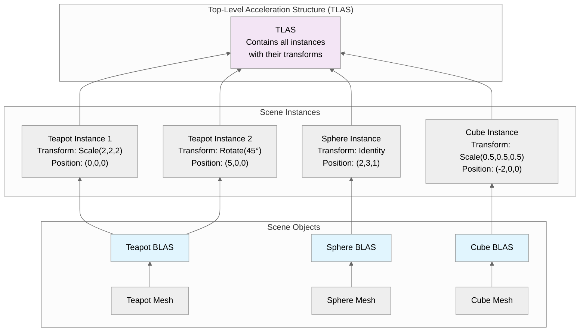
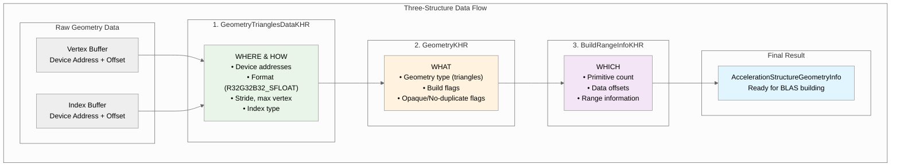
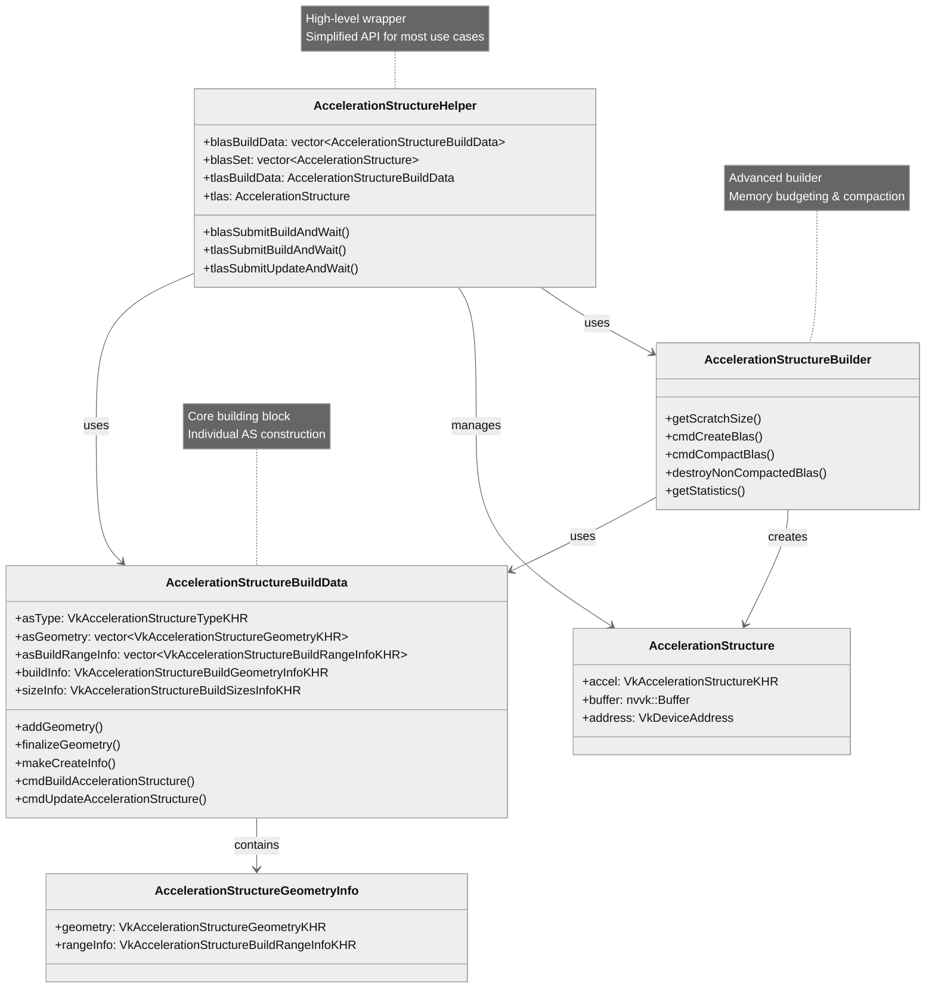
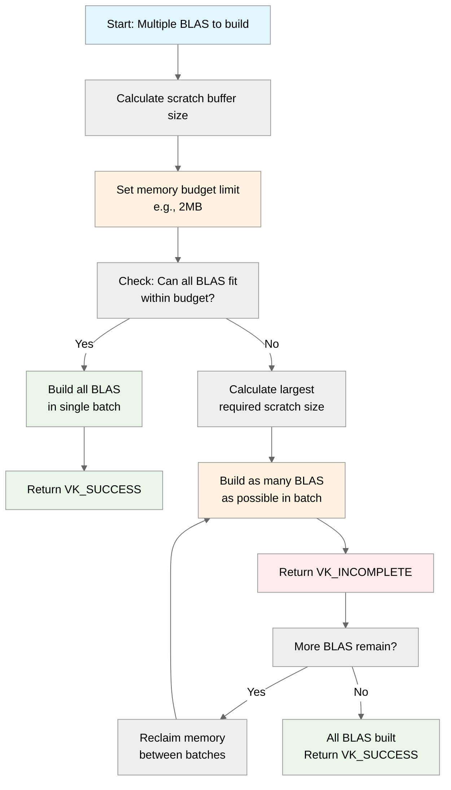
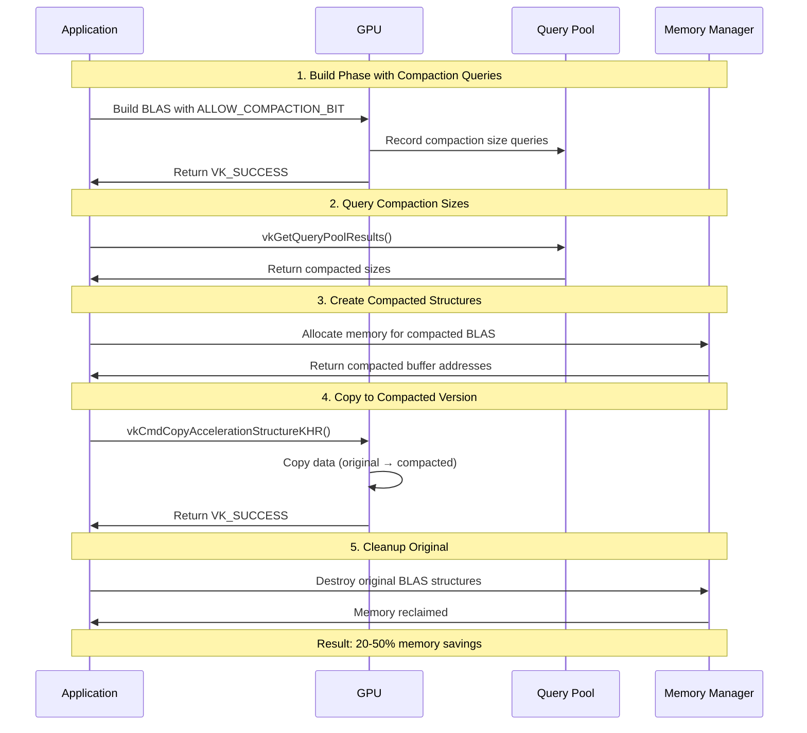

# Vulkan Acceleration Structures - Complete Guide

## Table of Contents

1. [Overview](#overview)
2. [Quick Start Guide](#quick-start-guide)
3. [Types of Acceleration Structures](#types-of-acceleration-structures)
4. [Practical Implementation Details](#practical-implementation-details)
5. [Helper Classes Architecture](#helper-classes-architecture)
6. [Advanced Usage with Budgeting](#advanced-usage-with-budgeting)
7. [Memory Management and Budgeting](#memory-management-and-budgeting)
8. [BLAS Compaction](#blas-compaction)
9. [Memory Barriers and Synchronization](#memory-barriers-and-synchronization)
10. [Best Practices](#best-practices)
11. [When to Use Each Approach](#when-to-use-each-approach)
12. [Conclusion](#conclusion)

---

## Overview

Acceleration structures in Vulkan ray tracing are hierarchical data structures that organize geometry for efficient ray intersection queries. They are essential for achieving real-time performance in ray tracing applications by reducing the number of ray-triangle intersection tests during rendering.

**Performance Benefits:**

- **Reduced Intersection Tests**: By organizing geometry hierarchically, ray tracing can skip large portions of the scene that a ray cannot possibly intersect
- **Hardware Acceleration**: Modern GPUs implement these structures in dedicated hardware for optimal performance
- **Scalable Rendering**: Performance scales logarithmically with scene complexity rather than linearly

## Quick Start Guide

Here's how to create acceleration structures in just 5 steps:

```cpp
// 1. Prepare geometry data
std::vector<nvvk::AccelerationStructureGeometryInfo> geoInfos;
for(const auto& mesh : meshes) {
    geoInfos.push_back(primitiveToGeometry(mesh));
}

// 2. Initialize the helper
nvvk::AccelerationStructureHelper asBuilder{};
asBuilder.init(&allocator, &stagingUploader, queue);

// 3. Build BLAS structures
asBuilder.blasSubmitBuildAndWait(geoInfos, 
    VK_BUILD_ACCELERATION_STRUCTURE_PREFER_FAST_TRACE_BIT_KHR);

// 4. Create TLAS instances
std::vector<VkAccelerationStructureInstanceKHR> tlasInstances;
for(const auto& instance : instances) {
    VkAccelerationStructureInstanceKHR ray_inst{};
    ray_inst.transform = nvvk::toTransformMatrixKHR(instance.transform);
    ray_inst.instanceCustomIndex = instance.meshIndex;
    ray_inst.accelerationStructureReference = asBuilder.blasSet[instance.meshIndex].address;
    ray_inst.mask = 0xFF;
    tlasInstances.push_back(ray_inst);
}

// 5. Build TLAS
asBuilder.tlasSubmitBuildAndWait(tlasInstances, 
    VK_BUILD_ACCELERATION_STRUCTURE_PREFER_FAST_TRACE_BIT_KHR);
```

**What this does:**

- **Step 1**: Converts your mesh data to acceleration structure geometry
- **Step 2**: Sets up the helper class for simplified creation
- **Step 3**: Builds bottom-level acceleration structures (BLAS) for geometry
- **Step 4**: Creates instances with transforms for scene composition
- **Step 5**: Builds top-level acceleration structure (TLAS) for the scene

**Prerequisites:**

- Mesh data with vertices and indices
- Instance transforms for positioning objects
- Resource allocator and command queue

This minimal setup handles all the complex memory management, alignment, and Vulkan API calls. See the sections below for detailed explanations and advanced features.

## Types of Acceleration Structures


### BLAS and TLAS Relationship

The following diagram illustrates how BLAS and TLAS structures work together in a typical scene:



### Bottom-Level Acceleration Structure (BLAS)
A BLAS contains the actual geometric primitives (triangles) and is built from:
- **Vertex Data**: 3D positions of vertices
- **Index Data**: Triangle indices
- **Build Flags**: Optimization hints (e.g., `VK_BUILD_ACCELERATION_STRUCTURE_PREFER_FAST_TRACE_BIT_KHR`)

**Key Characteristics:**

- BLASes store the actual vertex data
- They are built from one or more vertex buffers, each with its own transformation matrix (separate from the TLAS matrices)
- Multiple positioned models can be stored within a single BLAS
- If an object is instantiated several times within the same BLAS, its geometry will be duplicated
- As a rule of thumb, the fewer BLAS, the better for performance on static, non-instantiated scene components

### Top-Level Acceleration Structure (TLAS)
A TLAS contains instances of BLAS structures and provides:
- **Instance References**: Pointers to BLAS structures
- **Transform Matrices**: Position, rotation, and scale of instances (3-by-4 transformation matrices)
- **Instance Metadata**: Custom indices, shader binding table offsets
- **Culling Information**: Visibility masks and flags

**Key Characteristics:**

- Contains object instances, each with its own transformation matrix and reference to a corresponding BLAS
- Typically corresponds to an entire scene built by positioning individual referenced BLASes
- Can be updated efficiently when only instance transforms change


## Practical Implementation Details

The Quick Start section above shows the complete workflow. Here are the key implementation details and considerations for each step:

### 1. Converting Mesh Data to Acceleration Structure Geometry

The `primitiveToGeometry` (from `02_basic.cpp`) function converts mesh data to Vulkan acceleration structure format. Here are the key parts:

```cpp
nvvk::AccelerationStructureGeometryInfo primitiveToGeometry(const nvsamples::GltfMeshResource& gltfMesh)
{
    nvvk::AccelerationStructureGeometryInfo result = {};

    const shaderio::TriangleMesh triMesh       = gltfMesh.mesh.triMesh;
    const auto                   triangleCount = static_cast<uint32_t>(triMesh.indices.count / 3U);

    // Describe buffer as array of VertexObj.
    VkAccelerationStructureGeometryTrianglesDataKHR triangles{
        .sType        = VK_STRUCTURE_TYPE_ACCELERATION_STRUCTURE_GEOMETRY_TRIANGLES_DATA_KHR,
        .vertexFormat = VK_FORMAT_R32G32B32_SFLOAT,  // vec3 vertex position data
        .vertexData   = {.deviceAddress = gltfMesh.bGltfData.address + triMesh.positions.offset},
        .vertexStride = triMesh.positions.byteStride,
        .maxVertex    = triMesh.positions.count - 1,
        .indexType = VkIndexType(gltfMesh.mesh.indexType),  // Index type (VK_INDEX_TYPE_UINT16 or VK_INDEX_TYPE_UINT32)
        .indexData = {.deviceAddress = gltfMesh.bGltfData.address + triMesh.indices.offset},
    };

    // Identify the above data as containing opaque triangles.
    result.geometry = VkAccelerationStructureGeometryKHR{
        .sType        = VK_STRUCTURE_TYPE_ACCELERATION_STRUCTURE_GEOMETRY_KHR,
        .geometryType = VK_GEOMETRY_TYPE_TRIANGLES_KHR,
        .geometry     = {.triangles = triangles},
        .flags        = VK_GEOMETRY_NO_DUPLICATE_ANY_HIT_INVOCATION_BIT_KHR | VK_GEOMETRY_OPAQUE_BIT_KHR,
    };

    result.rangeInfo = VkAccelerationStructureBuildRangeInfoKHR{.primitiveCount = triangleCount};

    return result;
}
```

**Important Considerations:**

- **Device Addresses**: Uses `gltfMesh.bGltfData.address + offset` to get device addresses
  for vertex/index data
- **Geometry Flags**:
  - `VK_GEOMETRY_OPAQUE_BIT_KHR`: Enables ray tracing optimizations for opaque geometry
  - `VK_GEOMETRY_NO_DUPLICATE_ANY_HIT_INVOCATION_BIT_KHR`: Prevents duplicate shader invocations
- **Primitive Count**: Calculated as `indices.count / 3` since each triangle uses 3 indices

#### Understanding the Three-Structure Data Flow

When creating acceleration structures, Vulkan uses three key structures that work together:




**1. VkAccelerationStructureGeometryTrianglesDataKHR:**
- Defines WHERE to read vertex/index data (device addresses) and HOW to interpret it (format, stride, etc.)

**2. VkAccelerationStructureGeometryKHR:**
- Wrapper that specifies WHAT type of geometry (triangles, instances, AABBs) and build flags

**3. VkAccelerationStructureBuildRangeInfoKHR:**
- Defines WHICH portion of the data to process (primitive count, offsets, etc.)

#### Geometry Types

Vulkan ray tracing supports three main geometry types:

**Triangles (`VK_GEOMETRY_TYPE_TRIANGLES_KHR`):**

- Traditional mesh geometry with vertex and index data
- Most common for standard 3D models
- Hardware-optimized for triangle intersection

**Instances (`VK_GEOMETRY_TYPE_INSTANCES_KHR`):**

- References to other acceleration structures
- Used in TLAS to reference BLAS structures
- Enables efficient scene composition

**AABBs (`VK_GEOMETRY_TYPE_AABBS_KHR`):**

- Axis-Aligned Bounding Boxes for implicit primitives
- Used with intersection shaders for procedural geometry
- Enables rendering of mathematical shapes (spheres, cubes, etc.) without explicit triangle meshes

---

**NVIDIA Extended Geometry Types** *(VK_NV_ray_tracing extensions)*

NVIDIA has extended the standard Vulkan ray tracing geometry types with two additional types that are **only available on the very latest NVIDIA RTX GPUs (Blackwell/RTX 50 series or newer)**:

**Spheres (`VK_GEOMETRY_TYPE_SPHERES_NV`):**

- Native support for perfect spheres without tessellation
- Geometry data: buffer of sphere parameters (center, radius)
- Hardware-accelerated intersection testing
- Requires intersection shaders for custom hit logic

**Linear Swept Spheres (`VK_GEOMETRY_TYPE_LINEAR_SWEPT_SPHERES_NV`):**

- Spheres swept along a linear path (capsules)
- Geometry data: buffer of swept-sphere parameters (center, radius, velocity/direction)
- Efficient representation of capsules and motion-blurred spheres


### 2. Creating Bottom-Level Acceleration Structures

From `02_basic.cpp` - `createBottomLevelAS` function. This creates all bottom-level acceleration structures in a single call using the high-level helper. The `AccelerationStructureHelper::blasSubmitBuildAndWait()` method handles all the complexity internally, including command buffer creation, memory allocation, proper synchronization, **memory budgeting**, and **automatic compaction** when the `VK_BUILD_ACCELERATION_STRUCTURE_ALLOW_COMPACTION_BIT_KHR` flag is set.

```cpp
void createBottomLevelAS()
{
    SCOPED_TIMER(__FUNCTION__);
    std::vector<nvvk::AccelerationStructureGeometryInfo> geoInfos(m_meshes.size());
    
    // Prepare geometry for each mesh
    for(uint32_t p_idx = 0; p_idx < m_meshes.size(); p_idx++)
    {
        geoInfos[p_idx] = primitiveToGeometry(m_meshes[p_idx]);
    }
    
    // Build all BLAS structures using the helper
    m_asBuilder.blasSubmitBuildAndWait(geoInfos, 
        VK_BUILD_ACCELERATION_STRUCTURE_PREFER_FAST_TRACE_BIT_KHR);
}
```

**Key Points:**

- **Geometry Collection**: Creates geometry info for each mesh in the scene
- **Helper Usage**: Uses `AccelerationStructureHelper::blasSubmitBuildAndWait()` for simplified BLAS creation
- **Build Flags**: Uses `VK_BUILD_ACCELERATION_STRUCTURE_PREFER_FAST_TRACE_BIT_KHR` for optimal ray tracing performance. Add `VK_BUILD_ACCELERATION_STRUCTURE_ALLOW_COMPACTION_BIT_KHR` to reduce memory footprint.

### 3. Creating Top-Level Acceleration Structure

From `02_basic.cpp` - `createTopLevelAS` function:

```cpp
void createTopLevelAS()
{
    std::vector<VkAccelerationStructureInstanceKHR> tlasInstances;
    tlasInstances.reserve(m_instances.size());
    const VkGeometryInstanceFlagsKHR flags{VK_GEOMETRY_INSTANCE_TRIANGLE_CULL_DISABLE_BIT_NV};
    
    for(const shaderio::GltfInstance& instance : m_instances)
    {
        VkAccelerationStructureInstanceKHR ray_inst{};
        ray_inst.transform           = nvvk::toTransformMatrixKHR(instance.transform);  // Position of the instance
        ray_inst.instanceCustomIndex = instance.meshIndex;                              // gl_InstanceCustomIndexEXT or InstanceID() (Slang)
        ray_inst.accelerationStructureReference = m_asBuilder.blasSet[instance.meshIndex].address;
        ray_inst.instanceShaderBindingTableRecordOffset = 0;  // We will use the same hit group for all objects
        ray_inst.flags                                  = flags;
        ray_inst.mask                                   = 0xFF;
        tlasInstances.emplace_back(ray_inst);
    }

    m_asBuilder.tlasSubmitBuildAndWait(tlasInstances, 
        VK_BUILD_ACCELERATION_STRUCTURE_PREFER_FAST_TRACE_BIT_KHR);
}
```

**Key Points:**

- **Instance Creation**: Creates instances for each mesh with transformation matrices
- **Transform Conversion**: Uses `nvvk::toTransformMatrixKHR()` to convert glm::mat4 to Vulkan format
- **BLAS Reference**: Links each instance to its corresponding BLAS via `accelerationStructureReference`
- **Instance Metadata**: Sets custom indices, SBT offsets, and visibility masks

## Helper Classes Architecture

### Class Hierarchy Overview

The following diagram shows the relationship between the different helper classes and their responsibilities:





### 1. AccelerationStructureHelper (High-Level Wrapper)

This is the **simplified interface** used in basic tutorials like `02_basic.cpp`:

```cpp
class AccelerationStructureHelper
{
public:
    // BLAS management
    std::vector<AccelerationStructureBuildData> blasBuildData;
    std::vector<AccelerationStructure> blasSet;
    
    // TLAS management
    AccelerationStructureBuildData tlasBuildData;
    AccelerationStructure tlas;
    
    // High-level build methods - these handle everything internally
    void blasSubmitBuildAndWait(const std::vector<AccelerationStructureGeometryInfo>& asGeoInfoSet,
                                VkBuildAccelerationStructureFlagsKHR buildFlags);
    void tlasSubmitBuildAndWait(const std::vector<VkAccelerationStructureInstanceKHR>& tlasInstances,
                                VkBuildAccelerationStructureFlagsKHR buildFlags);
    void tlasSubmitUpdateAndWait(const std::vector<VkAccelerationStructureInstanceKHR>& tlasInstances);
};
```

**Usage Pattern:**

```cpp
// Initialize helper
nvvk::AccelerationStructureHelper m_asBuilder{};
m_asBuilder.init(&m_allocator, &m_stagingUploader, app->getQueue(0));

// Build BLAS - one-liner that handles all complexity
m_asBuilder.blasSubmitBuildAndWait(geoInfos, VK_BUILD_ACCELERATION_STRUCTURE_PREFER_FAST_TRACE_BIT_KHR);

// Build TLAS - automatically handles BLAS references
m_asBuilder.tlasSubmitBuildAndWait(tlasInstances, VK_BUILD_ACCELERATION_STRUCTURE_PREFER_FAST_TRACE_BIT_KHR);
```

### 2. AccelerationStructureBuildData (Core Building Block)

This struct manages the construction process for a single acceleration structure:

```cpp
struct AccelerationStructureBuildData
{
    VkAccelerationStructureTypeKHR asType;  // BLAS or TLAS
    std::vector<VkAccelerationStructureGeometryKHR> asGeometry;
    std::vector<VkAccelerationStructureBuildRangeInfoKHR> asBuildRangeInfo;
    VkAccelerationStructureBuildGeometryInfoKHR buildInfo;
    VkAccelerationStructureBuildSizesInfoKHR sizeInfo;
    
    // Core methods for building and updating
    void addGeometry(const AccelerationStructureGeometryInfo& asGeom);
    VkAccelerationStructureBuildSizesInfoKHR finalizeGeometry(VkDevice device, VkBuildAccelerationStructureFlagsKHR flags);
    VkAccelerationStructureCreateInfoKHR makeCreateInfo() const;
    void cmdBuildAccelerationStructure(VkCommandBuffer cmd, VkAccelerationStructureKHR accelerationStructure, VkDeviceAddress scratchAddress);
    void cmdUpdateAccelerationStructure(VkCommandBuffer cmd, VkAccelerationStructureKHR accelerationStructure, VkDeviceAddress scratchAddress);
    
    // TLAS-specific helper
    AccelerationStructureGeometryInfo makeInstanceGeometry(size_t numInstances, VkDeviceAddress instanceBufferAddr);
    
    // Utility methods
    bool hasCompactFlag() const;
};
```

**Key Methods Explained:**

**`finalizeGeometry(device, flags)`** - **Crucial for the build process:**

- **Purpose**: Configures the build information and calculates the exact memory requirements
- **What it does**:
  - Sets up the `buildInfo` structure with geometry count, build flags, and mode
  - Calls `vkGetAccelerationStructureBuildSizesKHR` to compute memory sizes
  - Returns `VkAccelerationStructureBuildSizesInfoKHR` containing:
    - `accelerationStructureSize`: Exact size needed for the acceleration structure
    - `buildScratchSize`: Size needed for the scratch buffer during building
    - `updateScratchSize`: Size needed for the scratch buffer during updates
- **When to call**: After adding all geometries, before memory allocation

**`makeCreateInfo()`** - Creates the Vulkan creation structure:

- **Purpose**: Generates a `VkAccelerationStructureCreateInfoKHR` structure ready for allocation
- **What it does**: Creates a properly configured create info structure with the exact size calculated by `finalizeGeometry`

### 3. AccelerationStructureBuilder (Advanced Builder)

This class provides manual control over memory budgeting, batching, and compaction:

```cpp
class AccelerationStructureBuilder
{
public:
    void init(nvvk::ResourceAllocator* allocator);
    void deinit();
    
    // Calculate optimal scratch buffer size
    VkDeviceSize getScratchSize(VkDeviceSize hintMaxBudget, 
                                const std::span<nvvk::AccelerationStructureBuildData>& buildData) const;
    
    // Build BLAS in batches (returns VK_INCOMPLETE if more work remains)
    VkResult cmdCreateBlas(VkCommandBuffer cmd,
                           std::span<AccelerationStructureBuildData>& blasBuildData,
                           std::span<nvvk::AccelerationStructure>& blasAccel,
                           VkDeviceAddress scratchAddress,
                           VkDeviceSize scratchSize,
                           VkDeviceSize hintMaxBudget = 512'000'000);
    
    // Compact built BLAS structures
    VkResult cmdCompactBlas(VkCommandBuffer cmd,
                            std::span<AccelerationStructureBuildData>& blasBuildData,
                            std::span<nvvk::AccelerationStructure>& blasAccel);
    
    // Clean up non-compacted versions
    void destroyNonCompactedBlas();
    
    // Get compaction statistics
    Stats getStatistics() const;
};
```

## Advanced Usage with Budgeting

This section shows how to implement memory-constrained BLAS building using the `AccelerationStructureBuilder` class. The key insight is that `cmdCreateBlas()` doesn't build all BLAS structures at once - it builds as many as possible within the memory budget and returns `VK_INCOMPLETE` when more work remains.

```cpp
void buildBLASWithBudgeting()
{
    std::span<AccelerationStructureBuildData> blasBuildData;
    std::span<AccelerationStructure>          blasAccel;

    AccelerationStructureBuilder blasBuilder;
    blasBuilder.init(&m_allocator);
    
    // Calculate optimal scratch buffer size
    VkDeviceSize scratchSize = blasBuilder.getScratchSize(hintScratchBudget, blasBuildData);
    
    // Create scratch buffer
    const VkDeviceSize alignment = m_accelStructProps.minAccelerationStructureScratchOffsetAlignment;
    m_allocator->createBuffer(blasScratchBuffer, scratchSize, 
         VK_BUFFER_USAGE_2_STORAGE_BUFFER_BIT | VK_BUFFER_USAGE_2_SHADER_DEVICE_ADDRESS_BIT | VK_BUFFER_USAGE_2_ACCELERATION_STRUCTURE_STORAGE_BIT_KHR, VMA_MEMORY_USAGE_AUTO, {}, alignment);
    
    // Start the build and compaction of the BLAS
    VkDeviceSize hintMaxBudget   = 2'000'000;  // Limiting the size of the scratch buffer to 2MB
    bool         finished        = false;
    
    // Build BLAS in batches
    do
    {
        VkCommandBuffer cmd = createSingleTimeCommands(device, commandPool);
        
        VkResult result = blasBuilder.cmdCreateBlas(cmd, blasBuildData, blasAccel, 
            scratchBuffer.address, scratchBuffer.bufferSize, hintMaxBudget);
             
        if(result == VK_SUCCESS)
            finished = true;
        else if(result != VK_INCOMPLETE)
            assert(0 && "Error building BLAS");
             
        endSingleTimeCommands(cmd, device, commandPool, queueInfo);
        
        // Compact if needed
        if(buildFlags & VK_BUILD_ACCELERATION_STRUCTURE_ALLOW_COMPACTION_BIT_KHR)
        {
            VkCommandBuffer cmd = createSingleTimeCommands(device, commandPool);
            blasBuilder.cmdCompactBlas(cmd, blasBuildData, blasAccel);
            endSingleTimeCommands(cmd, device, commandPool, queueInfo);
            blasBuilder.destroyNonCompactedBlas();
        }
    } while(!finished);
    
    // Get statistics
    auto stats = blasBuilder.getStatistics();
    printf("Compaction saved: %s\n", stats.toString().c_str());

    // Cleanup
    blasBuilder.deinit();
}
```

## Memory Management and Budgeting

Now that you've seen the implementation, let's understand how `cmdCreateBlas()` works internally and what the key concepts mean:





### How `cmdCreateBlas()` Works

The `AccelerationStructureBuilder::cmdCreateBlas()` method is the core of memory-constrained acceleration structure building. Here's what happens inside:

1. **Memory Budget Check**: The method calculates how many BLAS structures can fit within the given `hintMaxBudget`
2. **Batch Processing**: It builds as many BLAS structures as possible in a single command buffer submission
3. **Return Status**: 
   - `VK_SUCCESS`: All BLAS structures were built successfully
   - `VK_INCOMPLETE`: More BLAS structures remain to be built


This strategy ensures that:

- If all BLAS structures fit within budget, they're built simultaneously for maximum performance
- If they don't fit, the builder uses the largest required scratch size and processes them in batches
- Memory usage never exceeds the specified budgeting `VK_INCOMPLETE` when more work remains
- Allowing you to reclaim memory between calls and continue building

## BLAS Compaction

BLAS compaction can significantly reduce memory usage (often 20-50% savings) by:
- **Removing Padding**: Eliminating alignment padding
- **Optimizing Data Layout**: Reorganizing internal data structures
- **Reducing Metadata**: Compacting internal acceleration structure metadata

### Compaction Process

The following diagram illustrates the complete BLAS compaction workflow:




**Step-by-step process:**

1. **Query Setup**: During building, record compaction size queries
2. **Size Retrieval**: After building, query the compacted size
3. **Compaction**: Create new, smaller acceleration structure
4. **Copying**: Copy data from original to compacted structure
5. **Cleanup**: Destroy original structure

```cpp
// Record compaction queries during building
if(queryPool != VK_NULL_HANDLE)
{
    vkCmdWriteAccelerationStructuresPropertiesKHR(cmd, numQueries, collectedAccel.data(),
        VK_QUERY_TYPE_ACCELERATION_STRUCTURE_COMPACTED_SIZE_KHR, queryPool, currentQueryIdx);
}

// Later, during compaction
VkDeviceSize compactSize = compactSizes[i];
if(compactSize > 0)
{
    // Create compacted acceleration structure
    VkAccelerationStructureCreateInfoKHR asCreateInfo{
        .sType = VK_STRUCTURE_TYPE_ACCELERATION_STRUCTURE_CREATE_INFO_KHR,
        .size = compactSize,
        .type = VK_ACCELERATION_STRUCTURE_TYPE_BOTTOM_LEVEL_KHR
    };
    
    // Copy from original to compacted
    VkCopyAccelerationStructureInfoKHR copyInfo{
        .sType = VK_STRUCTURE_TYPE_COPY_ACCELERATION_STRUCTURE_INFO_KHR,
        .src = originalBlas,
        .dst = compactedBlas,
        .mode = VK_COPY_ACCELERATION_STRUCTURE_MODE_COMPACT_KHR
    };
    vkCmdCopyAccelerationStructureKHR(cmd, &copyInfo);
}
```

## Memory Barriers and Synchronization

Proper synchronization is crucial for acceleration structure operations:

```cpp
// Before triggering the acceleration structure build
nvvk::accelerationStructureBarrier(cmdBuffer,
    VK_ACCESS_ACCELERATION_STRUCTURE_WRITE_BIT_KHR,
    VK_ACCESS_ACCELERATION_STRUCTURE_READ_BIT_KHR | VK_ACCESS_2_SHADER_READ_BIT);

// After building, before using it
nvvk::accelerationStructureBarrier(cmdBuffer, 
    VK_ACCESS_ACCELERATION_STRUCTURE_WRITE_BIT_KHR,
    VK_ACCESS_ACCELERATION_STRUCTURE_READ_BIT_KHR);
```

**Critical Memory Safety Note:** The acceleration structure builder only stores device addresses to your vertex buffers - it does **not** copy or manage the actual vertex data. You must ensure that all vertex buffers remain valid throughout the entire lifetime of the acceleration structure.

## Best Practices

1. **Memory Budgeting**: Always set reasonable memory budgets to prevent out-of-memory conditions
2. **Compaction**: Use compaction for BLAS when memory is constrained
3. **Batch Building**: Build multiple BLAS simultaneously when possible
4. **Update vs. Rebuild**: Use update operations for TLAS when instance transforms change
5. **Scratch Buffer Reuse**: Reuse scratch buffers across multiple builds when possible
6. **Proper Synchronization**: Always use memory barriers between build and usage phases
7. **Instance Limits**: Be aware of `VkPhysicalDeviceAccelerationStructurePropertiesKHR::maxInstanceCount` when designing large scenes
8. **BLAS Optimization**: For static scenes, prefer fewer, larger BLAS structures over many small ones
9. **Geometry Flags**: Use appropriate geometry flags (opaque, no-duplicate) for optimal performance

## When to Use Each Approach

- **AccelerationStructureHelper**: For most applications requiring acceleration structures with automatic memory budgeting, compaction support, and simplified API. This is the recommended choice for production applications as it handles complex memory management internally while remaining easy to use.
- **AccelerationStructureBuilder**: For advanced scenarios requiring fine-grained control over memory budgeting, custom batching strategies, or when you need to integrate acceleration structure building into custom rendering pipelines.
- **Direct API calls**: For maximum control and custom optimization, typically only needed for specialized use cases or when implementing custom acceleration structure algorithms.

## Conclusion

Acceleration structures are complex but essential components in Vulkan ray tracing. Understanding their construction process, memory management, and optimization techniques is crucial for building efficient ray tracing applications. The provided helper classes abstract much of this complexity while maintaining flexibility for advanced use cases.

The key is to balance between ease of use (using helpers) and performance optimization (using lower-level APIs) based on your specific requirements.

**Summary of Key Classes:**

- **`AccelerationStructureBuildData`**: Core building block for individual acceleration structures
- **`AccelerationStructureBuilder`**: Advanced builder for memory-constrained scenarios with compaction support
- **`AccelerationStructureHelper`**: High-level wrapper for simple use cases
- **`AccelerationStructureGeometryInfo`**: Geometry data container for easy setup
