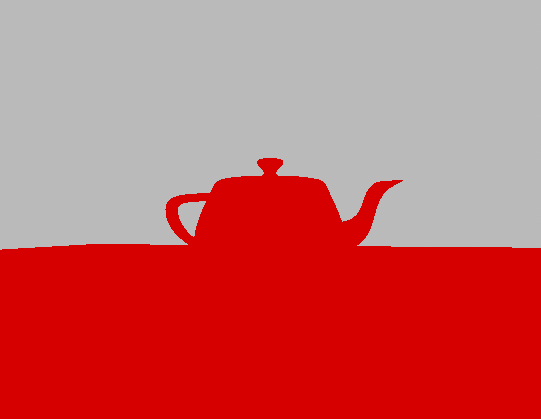
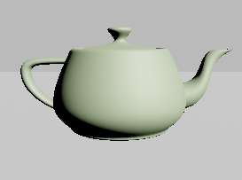

# Vulkan Ray Tracing Tutorial (v2)

> **Repository**: [github.com/nvpro-samples/vk_raytracing_tutorial_KHR](https://github.com/nvpro-samples/vk_raytracing_tutorial_KHR)  
> **Author**: Martin-Karl Lefrançois, NVIDIA

## Progressive Conversion from Rasterization to Ray Tracing

| Before | After |
| ------ | ----- |
|  |  |

## Introduction

This comprehensive tutorial demonstrates how to progressively convert a modern Vulkan 1.4 rasterization application to use ray tracing. We'll transform the `01_foundation` sample (which uses traditional vertex/fragment shaders) into `02_basic` (which uses ray tracing pipelines) through **8 progressive phases**, each resulting in a compilable and testable state.

### Two Implementation Approaches

This tutorial series provides **two different implementations** of the same ray tracing concepts:

- **`02_basic`** - Uses **direct Vulkan calls** for educational purposes, showing the complete ray tracing implementation without helper libraries
- **`02_basic_nvvk`** - Uses **nvpro-core2 helper libraries** (`nvvk::AccelerationStructureHelper` and `nvvk::SBTGenerator`) for simplified development

**This progressive tutorial focuses on the direct Vulkan approach** (`02_basic`) to teach the fundamentals. The helper version (`02_basic_nvvk`) is used in all subsequent tutorials in the series for better performance and maintainability.

### Tutorial Philosophy

This tutorial is designed with **progressive compilation** in mind:

- Each phase results in a compilable application
- Users can see incremental progress at each step
- Clear checkpoints allow for testing and validation
- Visual feedback shows what changed from the previous phase

### Prerequisites

- Vulkan 1.4+ with ray tracing extensions
- Graphics card supporting `VK_KHR_ray_tracing_pipeline`
- nvpro-core2 framework
- CMake build system
- Basic familiarity with Vulkan concepts

## Table of Contents

1. **[Setup Instructions](#setup-instructions)** - Create working copy and verify build
2. **[Understanding Acceleration Structures: BLAS vs TLAS](#understanding-acceleration-structures-blas-vs-tlas)** - Learn the fundamentals of ray tracing data structures
3. **[Understanding the Shader Binding Table (SBT)](#understanding-the-shader-binding-table-sbt)** - Learn how ray tracing shaders are organized and executed
4. **[Phase 1: Foundation Setup](#-phase-1-foundation-setup)** - Add ray tracing headers and enable extensions
5. **[Phase 2: Acceleration Structure Infrastructure](#-phase-2-acceleration-structure-infrastructure)** - Set up BLAS/TLAS creation helpers
6. **[Phase 3: Basic Acceleration Structures](#-phase-3-basic-acceleration-structures)** - Create and build acceleration structures
7. **[Phase 4: Ray Tracing Pipeline Setup](#-phase-4-ray-tracing-pipeline-setup)** - Create pipeline and SBT infrastructure
8. **[Phase 5: Basic Ray Tracing Shaders](#-phase-5-basic-ray-tracing-shaders)** - Implement minimal ray tracing shaders
9. **[Phase 6: Integration and Rendering](#-phase-6-integration-and-rendering)** - Replace rasterization with ray tracing
10. **[Phase 7: Material Shading](#-phase-7-material-shading)** - Add proper PBR material shading
11. **[Phase 8: Lighting and Shadows](#-phase-8-lighting-and-shadows)** - Add realistic lighting and shadow casting
12. **[Tutorial Completion Summary](#tutorial-completion-summary)** - What you've accomplished and next steps

## Setup Instructions

Before starting, make sure to do the following [setup](setup.md).

### **Tutorial Workflow**

**Phase-by-Phase Approach:**

1. **Start with Working Copy**: Always work in `01_foundation_copy/`
2. **Follow Each Phase**: Make changes as specified in the tutorial
3. **Test After Each Phase**: Compile and run to verify progress
4. **Compare When Needed**: Reference `01_foundation/` or `02_basic/` as needed

**File Modifications:**

- **`01_foundation.cpp`**: Main source file with class modifications
- **`shaders/rtbasic.slang`**: New ray tracing shader file (created in Phase 5)
- **`CMakeLists.txt`**: May need minor updates for new shaders

### **Tutorial Navigation**

This tutorial is designed as a **single comprehensive document** for several reasons:

- **Progressive Learning**: See the complete conversion journey from start to finish
- **Cross-Phase References**: Each phase builds on previous phases naturally
- **Complete Context**: All information in one place for reference
- **Easy Search**: Use Ctrl+F to find specific concepts across all phases
- **Easier Navigation**: Table of contents with anchor links works well

**Navigation Tips:**

- Use the table of contents above to jump to specific phases
- Each phase has clear "What's Next" sections
- Code changes are clearly marked with file paths
- Compilation checkpoints are provided after each phase

### What You'll Learn

By the end of this tutorial, you'll understand:

- How to enable ray tracing extensions in Vulkan
- Acceleration structure creation and management
- Ray tracing pipeline setup and shader binding tables
- Converting from rasterization to ray-based rendering
- Progressive development methodology for complex features

## Overview: From Rasterization to Ray Tracing

### Before: Rasterization Pipeline


### After: Ray Tracing Pipeline


## Understanding Acceleration Structures: BLAS vs TLAS

Ray tracing requires efficient data structures to quickly determine which geometry a ray might intersect. Vulkan uses a two-level acceleration structure hierarchy that separates geometric data from scene organization. Understanding this concept is crucial before implementing ray tracing.

### BLAS (Bottom-Level Acceleration Structure)

**What it contains**: The actual geometric data for individual meshes (triangles, vertices, indices). Note: Normals, UVs and other attributes are not stored in the BLAS itself - they are accessed separately in shaders.

**Purpose**: Organizes triangle geometry into a spatial data structure (typically a Bounding Volume Hierarchy) for fast ray-triangle intersection testing

**Quantity**: Typically one BLAS per unique mesh, but multiple meshes can be combined into a single BLAS for optimization. In this tutorial, we use one BLAS per mesh for simplicity.

**Example**: A teapot mesh gets its own BLAS containing all the teapot's triangles organized for efficient ray intersection

### TLAS (Top-Level Acceleration Structure)

**What it contains**: References to BLAS structures along with their world-space transformations (position, rotation, scale)

**Purpose**: Organizes scene instances for efficient ray-scene intersection testing

**Quantity**: One TLAS for the entire scene

**Example**: The TLAS contains instances like "teapot BLAS at position (1,0,1) with rotation 45° and scale 2.0"

### Why Two Levels?

This two-level hierarchy provides several key benefits:

- **Efficiency**: Static geometry (BLAS) can be built once and reused multiple times
- **Flexibility**: The same mesh can appear multiple times in different locations (instancing)
- **Performance**: Dynamic objects can update their TLAS entries without rebuilding expensive BLAS structures
- **Memory**: Shared geometry is stored only once in BLAS, referenced multiple times in TLAS

### Ray Tracing Process

1. **Ray Generation**: Ray starts from camera through a pixel
2. **TLAS Intersection**: Ray intersects with TLAS to find which instances might be hit
3. **BLAS Testing**: For each potential hit, ray is transformed and tested against the corresponding BLAS
4. **Hit Determination**: Closest intersection determines the hit point and material

### Key Differences

| Aspect | BLAS | TLAS |
|--------|------|------|
| **Data Type** | Triangle geometry, AABBs | Instance references |
| **Content** | Vertices, indices, normals | Transform matrices, BLAS references |
| **Quantity** | One per mesh/object | One per scene |
| **Updates** | Rarely (static geometry) | Frequently (dynamic objects) |
| **Memory** | Large (geometry data) | Small (instance data) |

### Visual Diagram

```mermaid
---

config:
  theme: 'neutral'
---
graph BT
    subgraph "Scene Objects"
        A[Teapot Mesh] --> B[Teapot BLAS]
        C[Sphere Mesh] --> D[Sphere BLAS]
        E[Cube Mesh] --> F[Cube BLAS]
    end
    
    subgraph "Scene Instances"
        G["Teapot Instance 1<br/>Transform: Scale(2,2,2)<br/>Position: (0,0,0)"]
        H["Teapot Instance 2<br/>Transform: Rotate(45°)<br/>Position: (5,0,0)"]
        I["Sphere Instance<br/>Transform: Identity<br/>Position: (2,3,1)"]
        J["Cube Instance<br/>Transform: Scale(0.5,0.5,0.5)<br/>Position: (-2,0,0)"]
    end
    
    subgraph "Top-Level Acceleration Structure (TLAS)"
        K[TLAS<br/>Contains all instances<br/>with their transforms]
    end
    
    B --> G
    B --> H
    D --> I
    F --> J
    
    G --> K
    H --> K
    I --> K
    J --> K
    
    style B fill:#e1f5fe
    style D fill:#e1f5fe
    style F fill:#e1f5fe
    style K fill:#f3e5f5
```



## Understanding the Shader Binding Table (SBT)

The Shader Binding Table (SBT) is the "blueprint" that tells the ray tracer which shaders to execute for different types of ray intersections. Unlike rasterization where shaders are bound sequentially, ray tracing requires all shaders to be available simultaneously since rays can hit any surface at any time.

### What is the SBT?

The SBT is a buffer containing **shader handles** - opaque identifiers that tell the GPU which shader program to execute. It's organized into four sections:

1. **Ray Generation Shaders**: Entry point for each pixel's primary ray
2. **Miss Shaders**: Executed when rays don't hit any geometry (background/sky)
3. **Hit Shaders**: Executed when rays intersect with geometry (material shading)
4. **Callable Shaders**: Optional shaders that can be invoked from other shaders

### Why Do We Need the SBT?

In ray tracing, a single ray can potentially hit any object in the scene, and different objects might need different shaders (e.g., different materials, transparency effects). The SBT provides a lookup table that maps:

- **Ray types** → **Which shader to execute**
- **Instance types** → **Which material shader to use**
- **Miss scenarios** → **Which background shader to use**

### SBT Structure and Flow


### Key Concepts

**Shader Handles**: Opaque identifiers (typically 32-64 bytes) that uniquely identify compiled shader programs in the pipeline.

**SBT Regions**: Each section (raygen, miss, hit, callable) has its own memory region with specific alignment requirements.

**Instance Association**: TLAS instances can specify which hit shader to use via a `hitGroupId` field.

**Data Attachment**: Hit shaders can have custom data attached (material properties, per-instance data) alongside the shader handle.

### Simple Example

For a basic scene with one material:

- **RayGen Section**: Contains handle for the ray generation shader
- **Miss Section**: Contains handle for the background shader (gray/sky)
- **Hit Section**: Contains handle for the material shader (PBR shading)

When a ray hits geometry, the ray tracer looks up the hit shader handle from the SBT and executes the corresponding shader program.

## Tutorial Structure

The tutorial is organized into **8 progressive phases**, each resulting in a compilable and testable state:

### **Phase Structure**

Each phase includes:

- **Phase Overview**: What this phase accomplishes and expected results
- **Code Changes**: Specific files and exact code modifications
- **Phase Checkpoint**: What you should see at each checkpoint with expected results

---

## 🔖 Phase 1: Foundation Setup

### Phase Overview

**Phase Objectives**: Enable ray tracing extensions and add basic infrastructure without breaking the existing rasterization pipeline.

- Add ray tracing headers and dependencies
- Enable ray tracing extensions in Vulkan context
- Add basic class members for ray tracing components
- Ensure the application still compiles and runs with rasterization

**Expected Result**: Application compiles with ray tracing extensions enabled, but still uses rasterization rendering.

### Code Changes

#### Step 1.1: Implementation Approach Overview

**Note**: This tutorial uses direct Vulkan calls for educational purposes.

**Implementation Comparison:**

- **This tutorial (`02_basic`)**: Uses direct Vulkan calls like `vkCmdBuildAccelerationStructuresKHR()` and `vkGetRayTracingShaderGroupHandlesKHR()`
- **Helper version (`02_basic_nvvk`)**: Uses `nvvk::AccelerationStructureHelper` and `nvvk::SBTGenerator` for simplified development

The helper libraries are used in all subsequent tutorials in this series (`02_basic_nvvk`, `03_any_hit`, etc.) for better performance and maintainability.

You can learn more about these concepts in:

- [Acceleration Structures](acceleration_structures.md)
- [Shader Binding Table](shader_binding_table.md)

#### Step 1.2: Add Ray Tracing Class Members

Add these members to your `RtFoundation` class (after the existing members):

```cpp
// Ray Tracing Pipeline Components
nvvk::DescriptorPack m_rtDescPack;               // Ray tracing descriptor bindings
VkPipeline           m_rtPipeline{};             // Ray tracing pipeline
VkPipelineLayout     m_rtPipelineLayout{};       // Ray tracing pipeline layout

// Acceleration Structure Components
std::vector<nvvk::AccelerationStructure> m_blasAccel;     // Bottom-level acceleration structures
nvvk::AccelerationStructure              m_tlasAccel;     // Top-level acceleration structure

// Direct SBT management
nvvk::Buffer                    m_sbtBuffer;         // Buffer for shader binding table
std::vector<uint8_t>            m_shaderHandles;     // Storage for shader group handles
VkStridedDeviceAddressRegionKHR m_raygenRegion{};    // Ray generation shader region
VkStridedDeviceAddressRegionKHR m_missRegion{};      // Miss shader region
VkStridedDeviceAddressRegionKHR m_hitRegion{};       // Hit shader region
VkStridedDeviceAddressRegionKHR m_callableRegion{};  // Callable shader region

// Ray Tracing Properties
VkPhysicalDeviceRayTracingPipelinePropertiesKHR m_rtProperties{
    VK_STRUCTURE_TYPE_PHYSICAL_DEVICE_RAY_TRACING_PIPELINE_PROPERTIES_KHR};
VkPhysicalDeviceAccelerationStructurePropertiesKHR m_asProperties{
    VK_STRUCTURE_TYPE_PHYSICAL_DEVICE_ACCELERATION_STRUCTURE_PROPERTIES_KHR};
```

These members provide everything needed for the new ray tracing pipeline: a vector to store all bottom-level acceleration structures, a top-level acceleration structure, storage for the shader binding table buffer and shader group handles, and structures to query ray tracing properties from the device.

#### Step 1.3: Enable Ray Tracing Extensions

In the `main()` function, add the required Vulkan extensions. Find the section where device extensions are defined and add:

```cpp
// Add ray tracing features
VkPhysicalDeviceAccelerationStructureFeaturesKHR accelFeature{
    VK_STRUCTURE_TYPE_PHYSICAL_DEVICE_ACCELERATION_STRUCTURE_FEATURES_KHR};
VkPhysicalDeviceRayTracingPipelineFeaturesKHR rtPipelineFeature{
    VK_STRUCTURE_TYPE_PHYSICAL_DEVICE_RAY_TRACING_PIPELINE_FEATURES_KHR};

// Add to device extensions (find the existing extensions array and add these)
{VK_KHR_ACCELERATION_STRUCTURE_EXTENSION_NAME, &accelFeature},     // Build acceleration structures
{VK_KHR_RAY_TRACING_PIPELINE_EXTENSION_NAME, &rtPipelineFeature},  // Use vkCmdTraceRaysKHR
{VK_KHR_DEFERRED_HOST_OPERATIONS_EXTENSION_NAME},                  // Required by ray tracing pipeline
```

> **Note**: The extensions are needed to enable Vulkan's ray tracing functionality, allowing the application to create and use acceleration structures and ray tracing pipelines.

#### Step 1.4: Initialize Ray Tracing Components

In the `onAttach()` method, add initialization for ray tracing components (after the existing initialization):

```cpp
// Get ray tracing properties
VkPhysicalDeviceProperties2 prop2{VK_STRUCTURE_TYPE_PHYSICAL_DEVICE_PROPERTIES_2};
m_rtProperties.pNext = &m_asProperties;
prop2.pNext          = &m_rtProperties;
vkGetPhysicalDeviceProperties2(m_app->getPhysicalDevice(), &prop2);
```

We request the ray tracing properties to determine device-specific limitations, such as acceleration structure alignment requirements. After calling `vkGetPhysicalDeviceProperties2`, you can set a breakpoint to inspect the returned property values.

### Phase 1 Checkpoint

**At this point, your application should:**

✅ **Compile successfully** with no errors or warnings  
✅ **Run without crashes** and display the same rasterized scene as `01_foundation`  
✅ **Have ray tracing extensions enabled** (check validation layers or debug output)  
✅ **Initialize ray tracing components** without using them yet

> **Test**:  
> After calling `vkGetPhysicalDeviceProperties2`, set a breakpoint and inspect the contents of `m_rtProperties` and `m_asProperties` to verify that the ray tracing and acceleration structure properties have been correctly retrieved from the device.

### What's Next

In Phase 2, we'll set up the infrastructure for creating acceleration structures. The application will still use rasterization, but we'll have the foundation ready for ray tracing geometry.

---

## 🔖 Phase 2: Acceleration Structure Infrastructure

### Phase Overview

**Phase Objectives**: Set up the infrastructure for creating acceleration structures without actually building them yet.

- Create geometry conversion helper methods
- Create Generic Acceleration Structure Helper
- Set up basic BLAS creation infrastructure (without building)
- Prepare for acceleration structure creation in the next phase

**Expected Result**: Infrastructure is ready for acceleration structure creation, but no acceleration structures are built yet. Application still uses rasterization.

### Code Changes

#### Step 2.1: Create Geometry Conversion Helper

Add this helper method to convert mesh data to acceleration structure geometry.

```cpp
void primitiveToGeometry(const shaderio::GltfMesh&                 gltfMesh,
                         VkAccelerationStructureGeometryKHR&       geometry,
                         VkAccelerationStructureBuildRangeInfoKHR& rangeInfo)
{
    const shaderio::TriangleMesh triMesh       = gltfMesh.triMesh;
    const auto                   triangleCount = static_cast<uint32_t>(triMesh.indices.count / 3U);

    // Describe buffer as array of VertexObj.
    VkAccelerationStructureGeometryTrianglesDataKHR triangles{
        .sType        = VK_STRUCTURE_TYPE_ACCELERATION_STRUCTURE_GEOMETRY_TRIANGLES_DATA_KHR,
        .vertexFormat = VK_FORMAT_R32G32B32_SFLOAT,  // vec3 vertex position data
        .vertexData   = {.deviceAddress = VkDeviceAddress(gltfMesh.gltfBuffer) + triMesh.positions.offset},
        .vertexStride = triMesh.positions.byteStride,
        .maxVertex    = triMesh.positions.count - 1,
        .indexType    = VkIndexType(gltfMesh.indexType),  // Index type (VK_INDEX_TYPE_UINT16 or VK_INDEX_TYPE_UINT32)
        .indexData    = {.deviceAddress = VkDeviceAddress(gltfMesh.gltfBuffer) + triMesh.indices.offset},
    };

    // Identify the above data as containing opaque triangles.
    geometry = VkAccelerationStructureGeometryKHR{
        .sType        = VK_STRUCTURE_TYPE_ACCELERATION_STRUCTURE_GEOMETRY_KHR,
        .geometryType = VK_GEOMETRY_TYPE_TRIANGLES_KHR,
        .geometry     = {.triangles = triangles},
        .flags        = VK_GEOMETRY_NO_DUPLICATE_ANY_HIT_INVOCATION_BIT_KHR | VK_GEOMETRY_OPAQUE_BIT_KHR,
    };

    rangeInfo = VkAccelerationStructureBuildRangeInfoKHR{.primitiveCount = triangleCount};
}
```

> **Note**: `shaderio::GltfMesh` is a geometry representation that may differ depending on your application. In this example, it follows the glTF format, where `gltfBuffer` points to the binary data (`.bin`), and the offset and stride are derived from the attribute accessor and buffer view.

> **Note**: The `shaderio::GltfMesh` data is uploaded to a GPU buffer, so it can be accessed directly by shaders, just as it is on the host.

#### Understanding the Three-Structure Data Flow

When creating acceleration structures, Vulkan uses three key structures that work together:

```mermaid
---
config:
  theme: neutral
---
flowchart TB
 subgraph subGraph0["Raw Geometry Data"]
        A["Vertex Buffer<br>Device Address + Offset"]
        B["Index Buffer<br>Device Address + Offset"]
  end
 subgraph subGraph1["GeometryTrianglesDataKHR"]
        C["WHERE &amp; HOW<br>• Device addresses<br>• Format (R32G32B32_SFLOAT)<br>• Stride, max vertex<br>• Index type"]
  end
 subgraph subGraph2["GeometryKHR"]
        D["WHAT<br>• Geometry type (triangles)<br>• Build flags<br>• Opaque/No-duplicate flags"]
  end
 subgraph subGraph3["BuildRangeInfoKHR"]
        E["WHICH<br>• Primitive count<br>• Data offsets<br>• Range information"]
  end
 subgraph subGraph4["Final Result"]
        F["AccelerationStructureGeometryInfo<br>Ready for BLAS building"]
  end
 subgraph subGraph5["Three-Structure Data Flow"]
        subGraph0
        subGraph1
        subGraph2
        subGraph3
        subGraph4
  end
    A --> C
    B --> C
    C --> D
    D --> E
    E --> F
    style C fill:#e8f5e8
    style D fill:#fff3e0
    style E fill:#f3e5f5
    style F fill:#e1f5fe
```



**1. VkAccelerationStructureGeometryTrianglesDataKHR:**

- Defines WHERE to read vertex/index data (device addresses) and HOW to interpret it (format, stride, etc.)

**2. VkAccelerationStructureGeometryKHR:**

- Wrapper that specifies WHAT type of geometry (triangles, instances, AABBs) and build flags

**3. VkAccelerationStructureBuildRangeInfoKHR:**

- Defines WHICH portion of the data to process (primitive count, offsets, etc.)

#### Geometry Types

Vulkan ray tracing supports three main geometry types:

**Triangles (`VK_GEOMETRY_TYPE_TRIANGLES_KHR`):**

- Traditional mesh geometry with vertex and index data
- Most common for standard 3D models
- Hardware-optimized for triangle intersection

**Instances (`VK_GEOMETRY_TYPE_INSTANCES_KHR`):**

- References to other acceleration structures
- Used in TLAS to reference BLAS structures
- Enables efficient scene composition

**AABBs (`VK_GEOMETRY_TYPE_AABBS_KHR`):**

- Axis-Aligned Bounding Boxes for implicit primitives
- Used with intersection shaders for procedural geometry
- Enables rendering of mathematical shapes (spheres, cubes, etc.) without explicit triangle meshes

---

**NVIDIA Extended Geometry Types** *(VK_NV_ray_tracing extensions)*

NVIDIA has extended the standard Vulkan ray tracing geometry types with two additional types that are **only available on the very latest NVIDIA RTX GPUs (Blackwell/RTX 50 series or newer)**:

**Spheres (`VK_GEOMETRY_TYPE_SPHERES_NV`):**

- Native support for perfect spheres without tessellation
- Geometry data: buffer of sphere parameters (center, radius)
- Hardware-accelerated intersection testing
- Requires intersection shaders for custom hit logic

**Linear Swept Spheres (`VK_GEOMETRY_TYPE_LINEAR_SWEPT_SPHERES_NV`):**

- Spheres swept along a linear path (capsules)
- Geometry data: buffer of swept-sphere parameters (center, radius, velocity/direction)
- Efficient representation of capsules and motion-blurred spheres

#### Step 2.2: Create Generic Acceleration Structure Helper

Add this generic helper method that can create both BLAS and TLAS acceleration structures. This method handles the common Vulkan acceleration structure creation process:

```cpp
// Generic function to create an acceleration structure (BLAS or TLAS)
// Note: This function creates and destroys a scratch buffer for each call.
// Not optimal but easier to read and understand. See Helper function for a better approach.
void createAccelerationStructure(VkAccelerationStructureTypeKHR asType,  // The type of acceleration structure (BLAS or TLAS)
                                 nvvk::AccelerationStructure& accelStruct,  // The acceleration structure to create
                                 VkAccelerationStructureGeometryKHR& asGeometry,  // The geometry to build the acceleration structure from
                                 VkAccelerationStructureBuildRangeInfoKHR& asBuildRangeInfo,  // The range info for building the acceleration structure
                                 VkBuildAccelerationStructureFlagsKHR flags  // Build flags (e.g. prefer fast trace)
)
{
    VkDevice device = m_app->getDevice();

    // Helper function to align a value to a given alignment
    auto alignUp = [](auto value, size_t alignment) noexcept { return ((value + alignment - 1) & ~(alignment - 1)); };

    // Fill the build information with the current information, the rest is filled later (scratch buffer and destination AS)
    VkAccelerationStructureBuildGeometryInfoKHR asBuildInfo{
        .sType         = VK_STRUCTURE_TYPE_ACCELERATION_STRUCTURE_BUILD_GEOMETRY_INFO_KHR,
        .type          = asType,  // The type of acceleration structure (BLAS or TLAS)
        .flags         = flags,   // Build flags (e.g. prefer fast trace)
        .mode          = VK_BUILD_ACCELERATION_STRUCTURE_MODE_BUILD_KHR,  // Build mode vs update
        .geometryCount = 1,                                               // Deal with one geometry at a time
        .pGeometries   = &asGeometry,  // The geometry to build the acceleration structure from
    };

    // One geometry at a time (could be multiple)
    std::vector<uint32_t> maxPrimCount(1);
    maxPrimCount[0] = asBuildRangeInfo.primitiveCount;

    // Find the size of the acceleration structure and the scratch buffer
    VkAccelerationStructureBuildSizesInfoKHR asBuildSize{.sType = VK_STRUCTURE_TYPE_ACCELERATION_STRUCTURE_BUILD_SIZES_INFO_KHR};
    vkGetAccelerationStructureBuildSizesKHR(device, VK_ACCELERATION_STRUCTURE_BUILD_TYPE_DEVICE_KHR, &asBuildInfo,
                                            maxPrimCount.data(), &asBuildSize);

    // Make sure the scratch buffer is properly aligned
    VkDeviceSize scratchSize = alignUp(asBuildSize.buildScratchSize, m_asProperties.minAccelerationStructureScratchOffsetAlignment);

    // Create the scratch buffer to store the temporary data for the build
    nvvk::Buffer scratchBuffer;
    NVVK_CHECK(m_allocator.createBuffer(scratchBuffer, scratchSize,
                                        VK_BUFFER_USAGE_2_STORAGE_BUFFER_BIT | VK_BUFFER_USAGE_2_SHADER_DEVICE_ADDRESS_BIT
                                            | VK_BUFFER_USAGE_2_ACCELERATION_STRUCTURE_STORAGE_BIT_KHR, VMA_MEMORY_USAGE_AUTO, {}, m_asProperties.minAccelerationStructureScratchOffsetAlignment));

    // Create the acceleration structure
    VkAccelerationStructureCreateInfoKHR createInfo{
        .sType = VK_STRUCTURE_TYPE_ACCELERATION_STRUCTURE_CREATE_INFO_KHR,
        .size  = asBuildSize.accelerationStructureSize,  // The size of the acceleration structure
        .type  = asType,  // The type of acceleration structure (BLAS or TLAS)
    };
    NVVK_CHECK(m_allocator.createAcceleration(accelStruct, createInfo));

    // Build the acceleration structure
    {
      VkCommandBuffer cmd = m_app->createTempCmdBuffer();

      // Fill with new information for the build,scratch buffer and destination AS
      asBuildInfo.dstAccelerationStructure  = accelStruct.accel;
      asBuildInfo.scratchData.deviceAddress = scratchBuffer.address;

      VkAccelerationStructureBuildRangeInfoKHR* pBuildRangeInfo = &asBuildRangeInfo;
      vkCmdBuildAccelerationStructuresKHR(cmd, 1, &asBuildInfo, &pBuildRangeInfo);

      m_app->submitAndWaitTempCmdBuffer(cmd);
    }
    // Cleanup the scratch buffer
    m_allocator.destroyBuffer(scratchBuffer);
}
```

> **Note**: This helper function encapsulates the complete Vulkan acceleration structure creation process. It handles memory alignment, scratch buffer creation, and the actual building command. The scratch buffer is temporary and is destroyed after building.

#### Understanding the `createAccelerationStructure` Helper

The `createAccelerationStructure` function is a generic helper that handles the complete Vulkan acceleration structure creation process. Here's what it does step by step:

##### 1. Build Information Setup

- Creates a `VkAccelerationStructureBuildGeometryInfoKHR` structure with the geometry data
- Sets the acceleration structure type (BLAS or TLAS), build flags, and mode

##### 2. Size Calculation

- Calls `vkGetAccelerationStructureBuildSizesKHR` to determine:
  - Size needed for the acceleration structure itself
  - Size needed for the scratch buffer (temporary working memory)
  - Size needed for the update scratch buffer (for future updates)

##### 3. Memory Alignment

- Aligns the scratch buffer size to meet hardware requirements using `minAccelerationStructureScratchOffsetAlignment`
- This ensures the scratch buffer address is properly aligned for the GPU

##### 4. Scratch Buffer Creation

- Creates a temporary buffer with the required size and usage flags:
  - `VK_BUFFER_USAGE_2_STORAGE_BUFFER_BIT` - Can be used as storage buffer
  - `VK_BUFFER_USAGE_2_SHADER_DEVICE_ADDRESS_BIT` - Has a device address
  - `VK_BUFFER_USAGE_2_ACCELERATION_STRUCTURE_STORAGE_BIT_KHR` - Can store acceleration structure data and force allocation alignment.

##### 5. Acceleration Structure Creation

- Creates the actual acceleration structure using `VkAccelerationStructureCreateInfoKHR`
- The size is determined by the build sizes calculation from step 2

##### 6. Building Process

- Records the build command using `vkCmdBuildAccelerationStructuresKHR`
- The command uses the scratch buffer for temporary storage during building
- Submits and waits for the command to complete

##### 7. Cleanup

- Destroys the temporary scratch buffer since it's no longer needed

This approach is straightforward but not optimal for performance. In a production application, you might want to:

- Reuse scratch buffers across multiple acceleration structures
- Build multiple acceleration structures in a single command buffer
- Use update mode for dynamic scenes instead of rebuilding from scratch

Note: The [acceleration helpers](acceleration_structures.md) handle all of this and more. However, to keep things simple, we are using a straightforward method here.

#### Step 2.3: Create BLAS Creation Method (Infrastructure Only)

Add this method to set up bottom-level acceleration structure creation. For now, it will just prepare the geometry data without building:

```cpp
void createBottomLevelAS()
{
    SCOPED_TIMER(__FUNCTION__);
    
    // Prepare geometry information for all meshes
    m_blasAccel.resize(m_sceneResource.meshes.size());
    
    // For now, just log that we're ready to build BLAS
    LOGI("  Ready to build %zu bottom-level acceleration structures\n", m_sceneResource.meshes.size());
    
    // TODO: In Phase 3, we'll add the actual building:
    // For each mesh 
    //   - create acceleration structure geometry from internal mesh primitive (primitiveToGeometry)
    //   - create acceleration structure
}
```

#### Step 2.4: Create TLAS Creation Method (Infrastructure Only)

Add this method to set up top-level acceleration structure creation:

```cpp
void createTopLevelAS()
{
    SCOPED_TIMER(__FUNCTION__);

    // VkTransformMatrixKHR is row-major 3x4, glm::mat4 is column-major; transpose before memcpy.
    auto toTransformMatrixKHR = [](const glm::mat4& m) {
      VkTransformMatrixKHR t;
      memcpy(&t, glm::value_ptr(glm::transpose(m)), sizeof(t));
      return t;
    };

    // Prepare instance data for TLAS
    std::vector<VkAccelerationStructureInstanceKHR> tlasInstances;
    tlasInstances.reserve(m_sceneResource.instances.size());
    
    for(const shaderio::GltfInstance& instance : m_sceneResource.instances)
    {
        VkAccelerationStructureInstanceKHR asInstance{};
        asInstance.transform                      = toTransformMatrixKHR(instance.transform);  // Position of the instance
        asInstance.instanceCustomIndex            = instance.meshIndex;                       // gl_InstanceCustomIndexEXT
        // asInstance.accelerationStructureReference = m_blasAccel[instance.meshIndex].address;  // Will be set in Phase 3
        asInstance.instanceShaderBindingTableRecordOffset = 0;  // We will use the same hit group for all objects
        asInstance.flags = VK_GEOMETRY_INSTANCE_TRIANGLE_CULL_DISABLE_BIT_NV;  // No culling - double sided
        asInstance.mask  = 0xFF;
        tlasInstances.emplace_back(asInstance);
    }
    
    // For now, just log that we're ready to build TLAS
    LOGI("  Ready to build top-level acceleration structure with %zu instances\n", tlasInstances.size());
    
    // TODO: In Phase 3, we'll add the actual building:
    // 1. Create and upload instance buffer
    // 2. Create TLAS geometry from instances
    // 3. Call createAccelerationStructure with TLAS type
}
```

We are preparing the acceleration structure. For bottom-level acceleration, the vertex and index data for the geometry are already on the GPU. For the instances, we will need to do the same. Here, we are only preparing the array of instances that will later be uploaded to the GPU.

#### Step 2.5: Call Infrastructure Setup

In the `onAttach()` method, add tot the end calls to set up the infrastructure:

```cpp
// Set up acceleration structure infrastructure
createBottomLevelAS();  // Set up BLAS infrastructure
createTopLevelAS();     // Set up TLAS infrastructure
```

### Phase 2 Checkpoint

**At this point, your application should:**

✅ **Compile successfully** with no errors or warnings  
✅ **Run without crashes** and display the same rasterized scene as before  
✅ **Show infrastructure setup messages** in the console output  
✅ **Have geometry conversion methods ready** for acceleration structure creation  

**What to verify:**

- Console output shows messages like "Ready to build X bottom-level acceleration structures"
- Console output shows "Ready to build top-level acceleration structure with X instances"
- The application looks identical to Phase 1 (still using rasterization)
- No memory leaks or validation errors

**Expected console output:**

```bash
Ready to build 2 bottom-level acceleration structures
Ready to build top-level acceleration structure with 2 instances
```

### What's Next

In Phase 3, we'll actually build the acceleration structures using the infrastructure we just set up. This will create the BLAS and TLAS that ray tracing needs for efficient geometry traversal.

---

## 🔖 Phase 3: Basic Acceleration Structures

### Phase Overview

**Phase Objectives**: Actually build the acceleration structures using the infrastructure from Phase 2.

- Build bottom-level acceleration structures (BLAS) for all meshes
- Build top-level acceleration structure (TLAS) for all instances
- Verify acceleration structures are created successfully
- Prepare for ray tracing pipeline creation

**Expected Result**: Acceleration structures are built and ready for ray tracing. Application still uses rasterization, but now has the geometry data structures needed for ray tracing.

**Documentation**: It is strongly recommended to read the [acceleration structure](acceleration_structures.md) document at this point. It explains the concepts and the helpers used here.

### Code Changes

#### Step 3.1: Enable BLAS Building

Update the `createBottomLevelAS()` method to actually build the acceleration structures:

```cpp
void createBottomLevelAS()
{
    SCOPED_TIMER(__FUNCTION__);

    // Prepare geometry information for all meshes
    m_blasAccel.resize(m_sceneResource.meshes.size());

    // One BLAS per primitive
    for(uint32_t blasId = 0; blasId < m_sceneResource.meshes.size(); blasId++)
    {
      VkAccelerationStructureGeometryKHR       asGeometry{};
      VkAccelerationStructureBuildRangeInfoKHR asBuildRangeInfo{};

      // Convert the primitive information to acceleration structure geometry
      primitiveToGeometry(m_sceneResource.meshes[blasId], asGeometry, asBuildRangeInfo);

      createAccelerationStructure(VK_ACCELERATION_STRUCTURE_TYPE_BOTTOM_LEVEL_KHR, m_blasAccel[blasId], asGeometry,
                                  asBuildRangeInfo, VK_BUILD_ACCELERATION_STRUCTURE_PREFER_FAST_TRACE_BIT_KHR);
      NVVK_DBG_NAME(m_blasAccel[blasId].accel);
    }
    
    LOGI("  Bottom-level acceleration structures built successfully\n");
}
```

> **Note**: This approach creates one BLAS per mesh using our generic `createAccelerationStructure` helper. Each BLAS contains the triangle geometry for one mesh.

#### Step 3.2: Enable TLAS Building

Update the `createTopLevelAS()` method to actually build the top-level acceleration structure:

```cpp
void createTopLevelAS()
{
    SCOPED_TIMER(__FUNCTION__);

    // VkTransformMatrixKHR is row-major 3x4, glm::mat4 is column-major; transpose before memcpy.
    auto toTransformMatrixKHR = [](const glm::mat4& m) {
      VkTransformMatrixKHR t;
      memcpy(&t, glm::value_ptr(glm::transpose(m)), sizeof(t));
      return t;
    };

    // First create the instance data for the TLAS
    std::vector<VkAccelerationStructureInstanceKHR> tlasInstances;
    tlasInstances.reserve(m_sceneResource.instances.size());
    for(const shaderio::GltfInstance& instance : m_sceneResource.instances)
    {
      VkAccelerationStructureInstanceKHR asInstance{};
      asInstance.transform                      = toTransformMatrixKHR(instance.transform);  // Position of the instance
      asInstance.instanceCustomIndex            = instance.meshIndex;                       // gl_InstanceCustomIndexEXT
      asInstance.accelerationStructureReference = m_blasAccel[instance.meshIndex].address;  // Address of the BLAS
      asInstance.instanceShaderBindingTableRecordOffset = 0;  // We will use the same hit group for all objects
      asInstance.flags = VK_GEOMETRY_INSTANCE_TRIANGLE_CULL_DISABLE_BIT_NV;  // No culling - double sided
      asInstance.mask  = 0xFF;
      tlasInstances.emplace_back(asInstance);
    }

    // Then create the buffer with the instance data
    nvvk::Buffer tlasInstancesBuffer;
    {
      VkCommandBuffer cmd = m_app->createTempCmdBuffer();

      // Create the instances buffer and upload the instance data
      NVVK_CHECK(m_allocator.createBuffer(
          tlasInstancesBuffer, std::span<VkAccelerationStructureInstanceKHR const>(tlasInstances).size_bytes(),
          VK_BUFFER_USAGE_2_ACCELERATION_STRUCTURE_BUILD_INPUT_READ_ONLY_BIT_KHR | VK_BUFFER_USAGE_2_SHADER_DEVICE_ADDRESS_BIT));
      NVVK_CHECK(m_stagingUploader.appendBuffer(tlasInstancesBuffer, 0,
                                                std::span<VkAccelerationStructureInstanceKHR const>(tlasInstances)));
      NVVK_DBG_NAME(tlasInstancesBuffer.buffer);
      m_stagingUploader.cmdUploadAppended(cmd);
      m_app->submitAndWaitTempCmdBuffer(cmd);
    }

    // Then create the TLAS geometry
    {
      VkAccelerationStructureGeometryKHR       asGeometry{};
      VkAccelerationStructureBuildRangeInfoKHR asBuildRangeInfo{};

      // Convert the instance information to acceleration structure geometry, similar to primitiveToGeometry()
      VkAccelerationStructureGeometryInstancesDataKHR geometryInstances{.sType = VK_STRUCTURE_TYPE_ACCELERATION_STRUCTURE_GEOMETRY_INSTANCES_DATA_KHR,
                                                                        .data = {.deviceAddress = tlasInstancesBuffer.address}};
      asGeometry       = {.sType        = VK_STRUCTURE_TYPE_ACCELERATION_STRUCTURE_GEOMETRY_KHR,
                          .geometryType = VK_GEOMETRY_TYPE_INSTANCES_KHR,
                          .geometry     = {.instances = geometryInstances}};
      asBuildRangeInfo = {.primitiveCount = static_cast<uint32_t>(m_sceneResource.instances.size())};

      createAccelerationStructure(VK_ACCELERATION_STRUCTURE_TYPE_TOP_LEVEL_KHR, m_tlasAccel, asGeometry,
                                  asBuildRangeInfo, VK_BUILD_ACCELERATION_STRUCTURE_PREFER_FAST_TRACE_BIT_KHR);
      NVVK_DBG_NAME(m_tlasAccel.accel);
    }

    LOGI("  Top-level acceleration structures built successfully\n");
    m_allocator.destroyBuffer(tlasInstancesBuffer);  // Cleanup
}
```

> **Note**: This builds a single top-level acceleration structure that includes all scene instances. The process involves creating instance data, uploading it to a GPU buffer, and then using that buffer to create the TLAS geometry.

> **Note**: Notice the similarity to BLAS creation; however, for TLAS we use `VkAccelerationStructureGeometryInstancesDataKHR` instead of `VkAccelerationStructureGeometryTrianglesDataKHR`. Vulkan also supports other geometry types such as AABBs—refer to the other tutorials for examples of their usage.

#### Step 3.3: Add Acceleration Structure Cleanup

In the `onDetach()` method, add the deinitialization of the ray tracing component (before the deinitialization of the allocator)

```cpp
    // Cleanup acceleration structures
    for(auto& blas : m_blasAccel)
    {
      m_allocator.destroyAcceleration(blas);
    }
    m_allocator.destroyAcceleration(m_tlasAccel);

    m_allocator.deinit();
```

This ensures that all BLAS and TLAS structures are properly destroyed when the application shuts down.

### Phase 3 Checkpoint

**At this point, your application should:**

✅ **Compile successfully** with no errors or warnings  
✅ **Run without crashes** and display the same rasterized scene as before  
✅ **Show successful acceleration structure building** in the console output  
✅ **Have increased GPU memory usage** due to acceleration structure storage  
✅ **Take slightly longer to start** due to acceleration structure building  

**Expected console output:**

```bash
RtFoundation::createBottomLevelAS  Bottom-level acceleration structures built successfully
RtFoundation::createTopLevelAS  Top-level acceleration structures built successfully
```

### Acceleration Structure Details

At this point, you have:

- **BLAS (Bottom-Level Acceleration Structures)**: One for each mesh, containing the actual triangle geometry
- **TLAS (Top-Level Acceleration Structure)**: One structure containing all instances with their transformations

The acceleration structures are now ready to be used by the ray tracing pipeline for efficient ray-geometry intersection testing.

### Testing with Night Graphics

We are not yet using the acceleration structures, but since they have been created, you can inspect them in Nsight Graphics.

- Launch Nsight Graphics and start a capture.
  - Ignore any validation errors; they are not caused by this application.
- Capture a frame.
- Open the Object Browser.
- Search for and select `RtBasic::createTopLevelAS::m_tlasAccel.accel`.
- Click "Open in Ray Tracing Inspector" to view the acceleration structure.


### What's Next

In Phase 4, we'll create the ray tracing pipeline and shader binding table infrastructure. The acceleration structures are ready, but we need the pipeline to actually use them for ray tracing.

---

## 🔖 Phase 4: Ray Tracing Pipeline Setup

### Phase Overview

**Phase Objectives**: Create the ray tracing pipeline and shader binding table infrastructure without implementing the actual shaders yet.

- Create ray tracing descriptor layout for TLAS and output image
- Set up basic ray tracing pipeline structure
- Create shader binding table infrastructure
- Prepare for shader implementation in the next phase

**Expected Result**: Ray tracing pipeline is created and ready for shaders. Application still uses rasterization, but now has the pipeline infrastructure needed for ray tracing.

### Code Changes

### Step 4.1: Add New Bindings

In `shaders\shaderio.h` add the new binding points we will need.

The first binding is for all textures used in the scene. We are now adding bindings for the output image (where the ray tracer writes its result) and the top-level acceleration structure (TLAS) used for ray tracing.

```hlsl
// Binding Points
enum BindingPoints
{
  eTextures = 0,  // Binding point for textures
  eOutImage,      // Binding point for output image
  eTlas,          // Top-level acceleration structure
};
```

#### Step 4.2: Create Ray Tracing Descriptor Layout

Add this method to your class (as a private method, after the `createTopLevelAS()` method from Phase 3):

```cpp
void createRaytraceDescriptorLayout()
{
    SCOPED_TIMER(__FUNCTION__);
    nvvk::DescriptorBindings bindings;
    bindings.addBinding({.binding = shaderio::BindingPoints::eTlas,
                         .descriptorType = VK_DESCRIPTOR_TYPE_ACCELERATION_STRUCTURE_KHR,
                         .descriptorCount = 1,
                         .stageFlags = VK_SHADER_STAGE_ALL});
    bindings.addBinding({.binding = shaderio::BindingPoints::eOutImage,
                         .descriptorType = VK_DESCRIPTOR_TYPE_STORAGE_IMAGE,
                         .descriptorCount = 1,
                         .stageFlags = VK_SHADER_STAGE_ALL});
    
    // Creating a PUSH descriptor set and set layout from the bindings
    m_rtDescPack.init(bindings, m_app->getDevice(), 0, 
        VK_DESCRIPTOR_SET_LAYOUT_CREATE_PUSH_DESCRIPTOR_BIT_KHR);
    
    LOGI("Ray tracing descriptor layout created\n");
}
```

> **Note**: This is a second descriptor set. The first descriptor set contains only the scene's textures. This new descriptor set adds access to the top-level acceleration structure and the output image produced by the ray tracer. In the shader, these will be accessed via `Set1`, while the textures remain in `Set0`.

#### Step 4.3: Create Basic Ray Tracing Pipeline Structure

Add this method to create the ray tracing pipeline (without shaders for now):

```cpp
void createRayTracingPipeline()
{
    SCOPED_TIMER(__FUNCTION__);

    // For re-creation
    m_allocator.destroyBuffer(m_sbtBuffer);
    vkDestroyPipeline(m_app->getDevice(), m_rtPipeline, nullptr);
    vkDestroyPipelineLayout(m_app->getDevice(), m_rtPipelineLayout, nullptr);

    // Creating all shaders (placeholder for now)
    enum StageIndices
    {
        eRaygen,
        eMiss,
        eClosestHit,
        eShaderGroupCount
    };
    std::array<VkPipelineShaderStageCreateInfo, eShaderGroupCount> stages{};
    for(auto& s : stages)
        s.sType = VK_STRUCTURE_TYPE_PIPELINE_SHADER_STAGE_CREATE_INFO;

    // TODO: In Phase 5, we'll add actual shader compilation
    // For now, create empty stages to test pipeline creation
    LOGI("Creating ray tracing pipeline structure (shaders will be added in Phase 5)\n");

    // Shader groups
    VkRayTracingShaderGroupCreateInfoKHR group{VK_STRUCTURE_TYPE_RAY_TRACING_SHADER_GROUP_CREATE_INFO_KHR};
    group.anyHitShader = VK_SHADER_UNUSED_KHR;
    group.closestHitShader = VK_SHADER_UNUSED_KHR;
    group.generalShader = VK_SHADER_UNUSED_KHR;
    group.intersectionShader = VK_SHADER_UNUSED_KHR;

    std::vector<VkRayTracingShaderGroupCreateInfoKHR> shader_groups;
    // Raygen
    group.type = VK_RAY_TRACING_SHADER_GROUP_TYPE_GENERAL_KHR;
    group.generalShader = eRaygen;
    shader_groups.push_back(group);

    // Miss
    group.type = VK_RAY_TRACING_SHADER_GROUP_TYPE_GENERAL_KHR;
    group.generalShader = eMiss;
    shader_groups.push_back(group);

    // closest hit shader
    group.type = VK_RAY_TRACING_SHADER_GROUP_TYPE_TRIANGLES_HIT_GROUP_KHR;
    group.generalShader = VK_SHADER_UNUSED_KHR;
    group.closestHitShader = eClosestHit;
    shader_groups.push_back(group);

    // Push constant: we want to be able to update constants used by the shaders
    const VkPushConstantRange push_constant{VK_SHADER_STAGE_ALL, 0, sizeof(shaderio::TutoPushConstant)};

    VkPipelineLayoutCreateInfo pipeline_layout_create_info{VK_STRUCTURE_TYPE_PIPELINE_LAYOUT_CREATE_INFO};
    pipeline_layout_create_info.pushConstantRangeCount = 1;
    pipeline_layout_create_info.pPushConstantRanges = &push_constant;

    // Descriptor sets: one specific to ray tracing, and one shared with the rasterization pipeline
    std::array<VkDescriptorSetLayout, 2> layouts = {{m_descPack.getLayout(), m_rtDescPack.getLayout()}};
    pipeline_layout_create_info.setLayoutCount = uint32_t(layouts.size());
    pipeline_layout_create_info.pSetLayouts = layouts.data();
    vkCreatePipelineLayout(m_app->getDevice(), &pipeline_layout_create_info, nullptr, &m_rtPipelineLayout);
    NVVK_DBG_NAME(m_rtPipelineLayout);

    VkRayTracingPipelineCreateInfoKHR rtPipelineInfo{VK_STRUCTURE_TYPE_RAY_TRACING_PIPELINE_CREATE_INFO_KHR};

    // TODO: In Phase 5, we'll add actual shader stages and create the pipeline
    // For now, just log that the pipeline layout is ready
    LOGI("Ray tracing pipeline layout created successfully\n");

    // Create the shader binding table for this pipeline
    createShaderBindingTable(rtPipelineInfo);
}
```

In this step, we've added the creation of the ray tracing pipeline layout. Because this function may be called multiple times (for example, when shaders are reloaded), we ensure that any previously created pipeline layout and related resources are properly destroyed before recreating them to avoid resource leaks.

Next, we define three essential shader groups for the ray tracing pipeline: the ray generation group, the miss group, and the closest hit group. These groups form the fundamental building blocks required for a minimal ray tracing pipeline.

Note that at this stage, the actual ray tracing pipeline itself is not yet created—this will be implemented in the next phase.

#### Step 4.4: Create Shader Binding Table Infrastructure

Add this method to set up the SBT infrastructure:

```cpp
void createShaderBindingTable(const VkRayTracingPipelineCreateInfoKHR& rtPipelineInfo)
{
    SCOPED_TIMER(__FUNCTION__);
    m_allocator.destroyBuffer(m_sbtBuffer);  // Cleanup when re-creating

    // TODO: In Phase 5, we'll populate this with actual shader data
    // For now, just prepare the infrastructure
    
    // Calculate required SBT buffer size (will be populated in Phase 5)
    size_t bufferSize = 1024; // Placeholder size
    
    // Create SBT buffer
    NVVK_CHECK(m_allocator.createBuffer(m_sbtBuffer, bufferSize, VK_BUFFER_USAGE_2_SHADER_BINDING_TABLE_BIT_KHR, VMA_MEMORY_USAGE_AUTO_PREFER_DEVICE,
                                        VMA_ALLOCATION_CREATE_MAPPED_BIT | VMA_ALLOCATION_CREATE_HOST_ACCESS_RANDOM_BIT));                                        
    NVVK_DBG_NAME(m_sbtBuffer.buffer);
    LOGI("Shader binding table buffer created (will be populated in Phase 5)\n");
}
```

This is a placeholder for the shader binding table (SBT) infrastructure. In the next phase, we will create the SBT buffer and populate it with the required shader group handles and layout information. The SBT is a critical structure in Vulkan ray tracing, as it defines how rays are dispatched and which shaders are invoked for each ray type. For now, we are only setting up the buffer and reserving space; actual population with shader data will be implemented in Phase 5.

#### Step 4.5: Call Pipeline Setup Methods

In the `onAttach()` method, after the acceleration structure creation calls, add these calls to set up the ray tracing pipeline:

```cpp
// Set up ray tracing pipeline infrastructure
createRaytraceDescriptorLayout();  // Create descriptor layout
createRayTracingPipeline();        // Create pipeline structure and SBT
```

### Step 4.6: Destroy The Added Elements

In the `onDetach()` method, mirror the destruction of the new element created

```cpp
    // Ray tracing components
    vkDestroyPipelineLayout(device, m_rtPipelineLayout, nullptr);
    vkDestroyPipeline(device, m_rtPipeline, nullptr);
    m_rtDescPack.deinit();
    m_allocator.destroyBuffer(m_sbtBuffer);
    // .. rest of function
```

### Phase 4 Checkpoint

**At this point, your application should:**

✅ **Compile successfully** with no errors or warnings  
✅ **Run without crashes** and display the same rasterized scene as before  
✅ **Show successful pipeline infrastructure creation** in the console output  
✅ **Have ray tracing pipeline layout and SBT buffer ready** for shader implementation  

**Expected console output:**

```bash
Ray tracing descriptor layout created
Creating ray tracing pipeline structure (shaders will be added in Phase 5)
Ray tracing pipeline layout created successfully
Shader binding table buffer created (will be populated in Phase 5)
```

### Pipeline Infrastructure Details

At this point, you have:

- **Descriptor Layout**: Ready to bind TLAS and output image to ray tracing shaders
- **Pipeline Layout**: Structure for ray tracing pipeline with push constants and descriptor sets
- **SBT Buffer**: Memory allocated for shader binding table (will be populated in Phase 5)

The pipeline infrastructure is now ready for shader implementation.

### What's Next

In Phase 5, we'll implement the actual ray tracing shaders (ray generation, closest hit, and miss shaders) and complete the pipeline creation. This will be the first phase where we actually start using ray tracing instead of rasterization.

---

## 🔖 Phase 5: Basic Ray Tracing Shaders

### Phase Overview

**Phase Objectives**: Implement the actual ray tracing shaders and complete the pipeline creation.

- Create minimal ray generation shader (simple ray casting)
- Create basic closest hit shader (solid color)
- Create simple miss shader (background color)
- Complete the ray tracing pipeline with actual shaders

**Expected Result**: Basic ray tracing pipeline is complete with working shaders. Application still uses rasterization, but now has a functional ray tracing pipeline ready for use.

### Code Changes

#### Step 5.1: Create Basic Ray Tracing Shader File

Create a new shader file `01_foundation_copy/shaders/rtbasic.slang` with the following content:

```hlsl
#include "shaderio.h"

#include "nvshaders/constants.h.slang"

// clang-format off
// Push constants containing scene information and camera data
[[vk::push_constant]]                           ConstantBuffer<TutoPushConstant> pushConst;
// Texture array for material textures
[[vk::binding(BindingPoints::eTextures, 0)]]    Sampler2D textures[];
// Top-level acceleration structure containing the scene geometry
[[vk::binding(BindingPoints::eTlas, 1)]]        RaytracingAccelerationStructure topLevelAS;
// Output image where the final rendered result will be stored
[[vk::binding(BindingPoints::eOutImage, 1)]]    RWTexture2D<float4> outImage;
// clang-format on

// Ray payload structure - carries data through the ray tracing pipeline
struct HitPayload
{
    float3 color;   // Accumulated color along the ray path
    float  weight;  // Weight/importance of this ray (for importance sampling)
    int    depth;   // Current recursion depth (for limiting bounces)
};

// Ray generation shader - entry point for each pixel
[shader("raygeneration")]
void rgenMain()
{
    // Get the current pixel coordinates and image dimensions
    float2 launchID = (float2)DispatchRaysIndex().xy;     // Current pixel (x,y)
    float2 launchSize = (float2)DispatchRaysDimensions().xy; // Image size (width,height)

    // Retrieve scene information from push constants
    GltfSceneInfo sceneInfo = pushConst.sceneInfoAddress[0];

    // Set ray tracing flags (0 = no special flags)
    const uint rayFlags = 0;
    
    // Convert pixel coordinates to normalized device coordinates (NDC)
    // Range: [-1,1] for both x and y
    const float2 clipCoords = launchID / launchSize * 2.0 - 1.0;
    
    // Transform from NDC to view space using inverse projection matrix
    const float4 viewCoords = mul(float4(clipCoords, 1.0, 1.0), sceneInfo.projInvMatrix);

    // Create the primary ray
    RayDesc ray;
    // Transform camera origin (0,0,0) from view space to world space
    ray.Origin = mul(float4(0.0, 0.0, 0.0, 1.0), sceneInfo.viewInvMatrix).xyz;
    // Transform ray direction from view space to world space
    ray.Direction = mul(float4(normalize(viewCoords.xyz), 0.0), sceneInfo.viewInvMatrix).xyz;
    ray.TMin = 0.001;    // Minimum distance to avoid self-intersection
    ray.TMax = INFINITE; // Maximum distance (infinite for primary rays)

    // Initialize ray payload with default values
    HitPayload payload;
    payload.color = float3(0, 0, 0);  // Start with black
    payload.weight = 1;               // Full weight for primary rays
    payload.depth = 0;                // Start at depth 0

    // Cast the ray into the scene using the acceleration structure
    // Parameters: AS, flags, instance mask, sbt offset, sbt stride, miss offset, ray, payload
    TraceRay(topLevelAS, rayFlags, 0xff, 0, 0, 0, ray, payload);
    
    // Get the final color from the ray tracing result
    float3 color = payload.color;
    
    // Write the result to the output image
    outImage[int2(launchID)] = float4(color, 1.0);
}

// Closest hit shader - called when ray hits geometry
[shader("closesthit")]
void rchitMain(inout HitPayload payload, in BuiltInTriangleIntersectionAttributes attr)
{
    // For now, just set a simple solid red color for all hits
    // In a full implementation, this would:
    // 1. Sample material properties (albedo, normal, etc.)
    // 2. Calculate lighting (direct + indirect)
    // 3. Potentially cast secondary rays (reflection, refraction)
    payload.color = float3(1, 0, 0); // Red color
}

// Miss shader - called when ray doesn't hit any geometry
[shader("miss")]
void rmissMain(inout HitPayload payload)
{
    // Set background color when ray misses all geometry
    // In a full implementation, this could sample from:
    // - Skybox textures
    // - Procedural sky gradients
    // - Environment maps
    payload.color = float3(0.5, 0.5, 0.5); // Gray background
}
```

> **💡Note**:  
> After adding the shader file, re-run CMake (Generate) to ensure it is included in your Visual Studio project.  
> Then, rebuild the project to generate the `_autogen/rtbasic.slang.h` header. This header contains the compiled SPIR-V version of your shader, allowing the application to embed shaders directly and avoid relying solely on external files.  
>
> For convenience during development and debugging, this tutorial also supports hot-reloading the shader file at runtime—so you can edit and test shader changes without restarting the application.

#### Step 5.1.1: Add Shader File

At the top of your CPP file, alongside the other auto-generated includes, add the following line to include the embedded Slang shader header (which contains the compiled SPIR-V for the ray tracing shaders):

```cpp
#include "_autogen/rtbasic.slang.h"     // Local shader
```

#### Step 5.2: Complete Ray Tracing Pipeline Creation

Update the `createRayTracingPipeline()` method to include actual shader compilation:

```cpp
void createRayTracingPipeline()
{
    SCOPED_TIMER(__FUNCTION__);

    // For re-creation
    vkDestroyPipeline(m_app->getDevice(), m_rtPipeline, nullptr);
    vkDestroyPipelineLayout(m_app->getDevice(), m_rtPipelineLayout, nullptr);

    // Creating all shaders
    enum StageIndices
    {
        eRaygen,
        eMiss,
        eClosestHit,
        eShaderGroupCount
    };
    std::array<VkPipelineShaderStageCreateInfo, eShaderGroupCount> stages{};
    for(auto& s : stages)
        s.sType = VK_STRUCTURE_TYPE_PIPELINE_SHADER_STAGE_CREATE_INFO;

    // Compile shader, fallback to pre-compiled
    VkShaderModuleCreateInfo shaderCode = compileSlangShader("rtbasic.slang", rtbasic_slang);

    stages[eRaygen].pNext = &shaderCode;
    stages[eRaygen].pName = "rgenMain";
    stages[eRaygen].stage = VK_SHADER_STAGE_RAYGEN_BIT_KHR;
    stages[eMiss].pNext = &shaderCode;
    stages[eMiss].pName = "rmissMain";
    stages[eMiss].stage = VK_SHADER_STAGE_MISS_BIT_KHR;
    stages[eClosestHit].pNext = &shaderCode;
    stages[eClosestHit].pName = "rchitMain";
    stages[eClosestHit].stage = VK_SHADER_STAGE_CLOSEST_HIT_BIT_KHR;

    // Shader groups
    VkRayTracingShaderGroupCreateInfoKHR group{VK_STRUCTURE_TYPE_RAY_TRACING_SHADER_GROUP_CREATE_INFO_KHR};
    group.anyHitShader = VK_SHADER_UNUSED_KHR;
    group.closestHitShader = VK_SHADER_UNUSED_KHR;
    group.generalShader = VK_SHADER_UNUSED_KHR;
    group.intersectionShader = VK_SHADER_UNUSED_KHR;

    std::vector<VkRayTracingShaderGroupCreateInfoKHR> shader_groups;
    // Raygen
    group.type = VK_RAY_TRACING_SHADER_GROUP_TYPE_GENERAL_KHR;
    group.generalShader = eRaygen;
    shader_groups.push_back(group);

    // Miss
    group.type = VK_RAY_TRACING_SHADER_GROUP_TYPE_GENERAL_KHR;
    group.generalShader = eMiss;
    shader_groups.push_back(group);

    // closest hit shader
    group.type = VK_RAY_TRACING_SHADER_GROUP_TYPE_TRIANGLES_HIT_GROUP_KHR;
    group.generalShader = VK_SHADER_UNUSED_KHR;
    group.closestHitShader = eClosestHit;
    shader_groups.push_back(group);

    // Push constant: we want to be able to update constants used by the shaders
    const VkPushConstantRange push_constant{VK_SHADER_STAGE_ALL, 0, sizeof(shaderio::TutoPushConstant)};

    VkPipelineLayoutCreateInfo pipeline_layout_create_info{VK_STRUCTURE_TYPE_PIPELINE_LAYOUT_CREATE_INFO};
    pipeline_layout_create_info.pushConstantRangeCount = 1;
    pipeline_layout_create_info.pPushConstantRanges = &push_constant;

    // Descriptor sets: one specific to ray tracing, and one shared with the rasterization pipeline
    std::array<VkDescriptorSetLayout, 2> layouts = {{m_descPack.getLayout(), m_rtDescPack.getLayout()}};
    pipeline_layout_create_info.setLayoutCount = uint32_t(layouts.size());
    pipeline_layout_create_info.pSetLayouts = layouts.data();
    vkCreatePipelineLayout(m_app->getDevice(), &pipeline_layout_create_info, nullptr, &m_rtPipelineLayout);
    NVVK_DBG_NAME(m_rtPipelineLayout);

    // Assemble the shader stages and recursion depth info into the ray tracing pipeline
    VkRayTracingPipelineCreateInfoKHR rtPipelineInfo{VK_STRUCTURE_TYPE_RAY_TRACING_PIPELINE_CREATE_INFO_KHR};
    rtPipelineInfo.stageCount = static_cast<uint32_t>(stages.size());
    rtPipelineInfo.pStages = stages.data();
    rtPipelineInfo.groupCount = static_cast<uint32_t>(shader_groups.size());
    rtPipelineInfo.pGroups = shader_groups.data();
    rtPipelineInfo.maxPipelineRayRecursionDepth = std::max(3U, m_rtProperties.maxRayRecursionDepth);
    rtPipelineInfo.layout = m_rtPipelineLayout;
    vkCreateRayTracingPipelinesKHR(m_app->getDevice(), {}, {}, 1, &rtPipelineInfo, nullptr, &m_rtPipeline);
    NVVK_DBG_NAME(m_rtPipeline);

    LOGI("Ray tracing pipeline created successfully\n");

    // Create the shader binding table for this pipeline
    createShaderBindingTable(rtPipelineInfo);
}
```

> **Note**: Two major changes were made in this phase. First, the Slang compiler is now invoked to generate SPIR-V code, and the resulting entry points are associated with each shader group (raygen, closest hit, miss). Second, the ray tracing pipeline is created by filling out the `VkRayTracingPipelineCreateInfoKHR` structure and calling `vkCreateRayTracingPipelinesKHR`. In the next section (5.3), we will create the shader binding table, which can be automatically generated using information from the `VkRayTracingPipelineCreateInfoKHR` structure.

> **Note**: Pay attention to `maxPipelineRayRecursionDepth`. This controls the maximum number of times a ray can recursively call `TraceRay()`. Initially, a value of 1 is sufficient since only the RayGen shader calls `TraceRay()`. However, when you add features like shadow rays from the closest hit shader, you'll need at least 2. Here, we set it to 3 to cover all immediate needs.

#### Step 5.3: Complete Shader Binding Table Creation

Update the `createShaderBindingTable()` method to populate the SBT with actual shader data:

**📖Documentation**: It is strongly recommended to read the [shader binding table](shader_binding_table.md) document at this point. It explains the concepts and implementation details.

```cpp
void createShaderBindingTable(const VkRayTracingPipelineCreateInfoKHR& rtPipelineInfo)
{
    SCOPED_TIMER(__FUNCTION__);
    m_allocator.destroyBuffer(m_sbtBuffer);  // Cleanup when re-creating

    VkDevice device          = m_app->getDevice();
    uint32_t handleSize      = m_rtProperties.shaderGroupHandleSize;
    uint32_t handleAlignment = m_rtProperties.shaderGroupHandleAlignment;
    uint32_t baseAlignment   = m_rtProperties.shaderGroupBaseAlignment;
    uint32_t groupCount      = rtPipelineInfo.groupCount;

    // Get shader group handles
    size_t dataSize = handleSize * groupCount;
    m_shaderHandles.resize(dataSize);
    NVVK_CHECK(vkGetRayTracingShaderGroupHandlesKHR(device, m_rtPipeline, 0, groupCount, dataSize, m_shaderHandles.data()));

    // Calculate SBT buffer size with proper alignment
    auto     alignUp      = [](uint32_t size, uint32_t alignment) { return (size + alignment - 1) & ~(alignment - 1); };
    uint32_t raygenSize   = alignUp(handleSize, handleAlignment);
    uint32_t missSize     = alignUp(handleSize, handleAlignment);
    uint32_t hitSize      = alignUp(handleSize, handleAlignment);
    uint32_t callableSize = 0;  // No callable shaders in this tutorial

    // Ensure each region starts at a baseAlignment boundary
    uint32_t raygenOffset   = 0;
    uint32_t missOffset     = alignUp(raygenSize, baseAlignment);
    uint32_t hitOffset      = alignUp(missOffset + missSize, baseAlignment);
    uint32_t callableOffset = alignUp(hitOffset + hitSize, baseAlignment);

    size_t bufferSize = callableOffset + callableSize;

    // Create SBT buffer
    NVVK_CHECK(m_allocator.createBuffer(m_sbtBuffer, bufferSize, VK_BUFFER_USAGE_2_SHADER_BINDING_TABLE_BIT_KHR, VMA_MEMORY_USAGE_AUTO_PREFER_DEVICE,
                                        VMA_ALLOCATION_CREATE_MAPPED_BIT | VMA_ALLOCATION_CREATE_HOST_ACCESS_RANDOM_BIT));
    NVVK_DBG_NAME(m_sbtBuffer.buffer);

    // Populate SBT buffer
    uint8_t* pData = static_cast<uint8_t*>(m_sbtBuffer.mapping);

    // Ray generation shader (group 0)
    memcpy(pData + raygenOffset, m_shaderHandles.data() + 0 * handleSize, handleSize);
    m_raygenRegion.deviceAddress = m_sbtBuffer.address + raygenOffset;
    m_raygenRegion.stride        = raygenSize;
    m_raygenRegion.size          = raygenSize;

    // Miss shader (group 1)
    memcpy(pData + missOffset, m_shaderHandles.data() + 1 * handleSize, handleSize);
    m_missRegion.deviceAddress = m_sbtBuffer.address + missOffset;
    m_missRegion.stride        = missSize;
    m_missRegion.size          = missSize;

    // Hit shader (group 2)
    memcpy(pData + hitOffset, m_shaderHandles.data() + 2 * handleSize, handleSize);
    m_hitRegion.deviceAddress = m_sbtBuffer.address + hitOffset;
    m_hitRegion.stride        = hitSize;
    m_hitRegion.size          = hitSize;

    // Callable shaders (none in this tutorial)
    m_callableRegion.deviceAddress = 0;
    m_callableRegion.stride        = 0;
    m_callableRegion.size          = 0;

    LOGI("Shader binding table created and populated \n");
}
```

#### Understanding the Direct SBT Implementation

This implementation demonstrates the core Vulkan functions needed for SBT creation:

##### 1. **Shader Group Handle Retrieval**

- `vkGetRayTracingShaderGroupHandlesKHR()` retrieves the opaque handles for each shader group
- These handles are used by the GPU to identify which shader to execute for each ray type
- The values come back in the oreder of creation.

##### 2. **Alignment Requirements**

- `shaderGroupHandleAlignment`: Alignment for individual shader group handle sizes
- `shaderGroupBaseAlignment`: Alignment for device addresses where each SBT region starts
- Both alignments are critical for proper GPU memory access

##### 3. **Buffer Layout**

- Each shader type (raygen, miss, hit, callable) gets its own region in the SBT buffer
- Regions are separated by `baseAlignment` boundaries to meet hardware requirements
- The buffer is CPU-mapped for direct memory access during population

##### 4. **Region Setup**

- Each region contains the device address, stride, and size information
- These regions are passed to `vkCmdTraceRaysKHR()` to specify which shaders to use
- The GPU uses these addresses to locate the appropriate shader handles during ray tracing

This direct approach provides complete control over SBT creation and helps understand the underlying Vulkan mechanics.

The `nvvk::SBTGenerator` utility simplifies the creation of the shader binding table (SBT) by automatically retrieving shader group handles and organizing them into the correct regions based on the `VkRayTracingPipelineCreateInfoKHR` configuration. It manages the association between shader group indices and their handles, and takes care of alignment and offset calculations when adding data to each group. This abstraction reduces the risk of manual errors and streamlines SBT setup, especially as pipelines become more complex (e.g., with multiple hit groups or callable shaders). In later tutorials, we will use `nvvk::SBTGenerator` to efficiently populate the SBT for advanced scenarios such as multiple closest hit shaders and callable shader groups.

### Phase 5 Checkpoint

**At this point, your application should:**

✅ **Compile successfully** with no errors or warnings  
✅ **Run without crashes** and display the same rasterized scene as before  
✅ **Show successful shader compilation and pipeline creation** in the console output  
✅ **Have a complete ray tracing pipeline** ready for use (but not yet used)  

**Expected console output:**

```bash
RtFoundation::compileSlangShader -> XX.XXX ms
Ray tracing pipeline created successfully
Shader binding table created and populated
```

### Shader Details

At this point, you have:

- **Ray Generation Shader**: Creates camera rays and traces them through the scene
- **Closest Hit Shader**: Returns a simple red color for any hit
- **Miss Shader**: Returns a gray background color for rays that miss geometry

The ray tracing pipeline is now complete and ready for use.

### What's Next

In Phase 6, we'll integrate the ray tracing pipeline into the rendering loop, replacing the rasterization rendering with ray tracing. This will be the first phase where you actually see ray traced output.

---

## 🔖 Phase 6: Integration and Rendering

### Phase Overview

**Phase Objectives**: Replace rasterization rendering with ray tracing to see the first ray traced output.

- Create ray tracing rendering method
- Add proper descriptor binding for TLAS and output image
- Update onRender method to use ray tracing
- Add toggle between rasterization and ray tracing

**Expected Result**: Full ray tracing pipeline working with simple red objects on gray background. You can toggle between rasterization and ray tracing to see the difference.

### Code Changes

#### Step 6.1: Create Ray Tracing Rendering Method

Add this method to handle ray tracing rendering:

```cpp
void raytraceScene(VkCommandBuffer cmd)
{
    NVVK_DBG_SCOPE(cmd);  // <-- Helps to debug in NSight

    // Ray trace pipeline
    vkCmdBindPipeline(cmd, VK_PIPELINE_BIND_POINT_RAY_TRACING_KHR, m_rtPipeline);

    // Bind the descriptor sets for the graphics pipeline (making textures available to the shaders)
    const VkBindDescriptorSetsInfo bindDescriptorSetsInfo{.sType = VK_STRUCTURE_TYPE_BIND_DESCRIPTOR_SETS_INFO,
                                                          .stageFlags = VK_SHADER_STAGE_ALL,
                                                          .layout = m_rtPipelineLayout,
                                                          .firstSet = 0,
                                                          .descriptorSetCount = 1,
                                                          .pDescriptorSets = m_descPack.getSetPtr()};
    vkCmdBindDescriptorSets2(cmd, &bindDescriptorSetsInfo);

    // Push descriptor sets for ray tracing
    nvvk::WriteSetContainer write{};
    write.append(m_rtDescPack.makeWrite(shaderio::BindingPoints::eTlas), m_tlasAccel);
    write.append(m_rtDescPack.makeWrite(shaderio::BindingPoints::eOutImage), m_gBuffers.getColorImageView(eImgRendered),
                 VK_IMAGE_LAYOUT_GENERAL);
    vkCmdPushDescriptorSetKHR(cmd, VK_PIPELINE_BIND_POINT_RAY_TRACING_KHR, m_rtPipelineLayout, 1, write.size(), write.data());

    // Push constant information
    shaderio::TutoPushConstant pushValues{
        .sceneInfoAddress = (shaderio::GltfSceneInfo*)m_sceneResource.bSceneInfo.address,
    };
    const VkPushConstantsInfo pushInfo{.sType = VK_STRUCTURE_TYPE_PUSH_CONSTANTS_INFO,
                                       .layout = m_rtPipelineLayout,
                                       .stageFlags = VK_SHADER_STAGE_ALL,
                                       .size = sizeof(shaderio::TutoPushConstant),
                                       .pValues = &pushValues};
    vkCmdPushConstants2(cmd, &pushInfo);

    // Ray trace
    const VkExtent2D& size = m_app->getViewportSize();
    vkCmdTraceRaysKHR(cmd, &m_raygenRegion, &m_missRegion, &m_hitRegion, &m_callableRegion, size.width, size.height, 1);

    // Barrier to make sure the image is ready for Tonemapping
    nvvk::cmdMemoryBarrier(cmd, VK_PIPELINE_STAGE_2_RAY_TRACING_SHADER_BIT_KHR, VK_PIPELINE_STAGE_2_COMPUTE_SHADER_BIT);
}
```

This function begins by binding the ray tracing pipeline, followed by binding the descriptor set that provides the scene's textures to the shaders. Next, it uses a push descriptor set to specify the top-level acceleration structure (TLAS) and the output image where the ray tracing results will be written. Unlike rasterization, where this image is attached as a framebuffer, in ray tracing we write directly to it. The push constant is set up similarly to graphics, providing per-frame data to the shaders. The function then calls `vkCmdTraceRaysKHR`, which dispatches the ray tracing pipeline and executes the associated shaders. Finally, a memory barrier ensures that the ray traced image is fully written and ready before it is post-processed by the tonemapper.

#### Step 6.2: Update Scene Buffer for Ray Tracing

**Important**: The `updateSceneBuffer()` function needs to be updated to include the inverse matrices required for ray generation. These matrices are used in the ray generation shader to convert screen coordinates to world space rays.

Find the `updateSceneBuffer()` method and ensure it includes these lines:

```cpp
void updateSceneBuffer(VkCommandBuffer cmd)
{
    NVVK_DBG_SCOPE(cmd);  // <-- Helps to debug in NSight
    const glm::mat4& viewMatrix = g_cameraManip->getViewMatrix();
    const glm::mat4& projMatrix = g_cameraManip->getPerspectiveMatrix();

    m_sceneResource.sceneInfo.viewProjMatrix = projMatrix * viewMatrix;   // Combine the view and projection matrices
    m_sceneResource.sceneInfo.projInvMatrix  = glm::inverse(projMatrix);  // Inverse projection matrix
    m_sceneResource.sceneInfo.viewInvMatrix  = glm::inverse(viewMatrix);  // Inverse view matrix
    m_sceneResource.sceneInfo.cameraPosition = g_cameraManip->getEye();   // Get the camera position
    m_sceneResource.sceneInfo.instances = (shaderio::GltfInstance*)m_sceneResource.bInstances.address;  // Get the address of the instance buffer
    
    // ... rest of the function
}
```

**Why these matrices are needed**:

- `projInvMatrix`: Used in the ray generation shader to convert from screen coordinates to view space
- `viewInvMatrix`: Used to transform from view space to world space for ray origin and direction
- These matrices enable the ray generation shader to create proper camera rays for each pixel

#### Step 6.3: Add Ray Tracing Toggle

Add a member variable to toggle between rasterization and ray tracing:

```cpp
// Ray tracing toggle
bool m_useRayTracing = true;  // Set to true to use ray tracing, false for rasterization
```

#### Step 6.4: Update onRender Method

Update the `onRender()` method to use ray tracing:

```cpp
void onRender(VkCommandBuffer cmd)
{
    // Update the scene information buffer, this cannot be done in between dynamic rendering
    updateSceneBuffer(cmd);

    if(m_useRayTracing)
    {
        raytraceScene(cmd);
    }
    else
    {
        rasterScene(cmd);
    }

    postProcess(cmd);
}
```

#### Step 6.5: Add UI Toggle (Optional)

Add the following UI toggle at the beginning of the `ImGui::Begin("Settings")` section in your `onUIRender()` method to allow switching between rasterization and ray tracing:

```cpp
// Ray tracing toggle
ImGui::Checkbox("Use Ray Tracing", &m_useRayTracing);
```

#### Step 6.6: Update Shader Reloading for Ray Tracing

**Important**: Update the `onUIMenu()` method to handle shader reloading for both rasterization and ray tracing modes. This ensures that pressing F5 or selecting "Reload Shaders" works correctly regardless of the current rendering mode.

Find the `onUIMenu()` method and update the reload logic:

```cpp
void onUIMenu() override
{
  bool reload = false;
  if(ImGui::BeginMenu("Tools"))
  {
    reload |= ImGui::MenuItem("Reload Shaders", "F5");
    ImGui::EndMenu();
  }
  reload |= ImGui::IsKeyPressed(ImGuiKey_F5);
  if(reload)
  {
    vkQueueWaitIdle(m_app->getQueue(0).queue);
      if(m_useRayTracing)
      {
        createRayTracingPipeline();
      }
      else
      {
        compileAndCreateGraphicsShaders();
      }
  }
}
```

This change ensures that:

- When ray tracing is enabled, F5 reloads the ray tracing pipeline (including all shader stages and SBT)
- When rasterization is enabled, F5 reloads the rasterization shader modules (vertex and fragment shaders)
- The shader reloading functionality works correctly for both rendering modes

Note: The rasterization mode only reloads the shader modules, not the entire graphics pipeline. The graphics pipeline itself is created during initialization and uses these shader modules at runtime.

### Phase 6 Checkpoint

**At this point, your application should:**

✅ **Compile successfully** with no errors or warnings  
✅ **Run without crashes** and display **ray traced output** (red objects on gray background)  
✅ **Show the first working ray tracing** instead of rasterization  
✅ **Allow toggling between ray tracing and rasterization** (if UI toggle was added)  

**Expected visual result:**

- Objects appear as solid red color (from the closest hit shader)
- Background appears gray (from the miss shader)
- Scene geometry is properly ray traced (objects should be visible and correctly positioned)



**How to Test Live Shader Reloading**

To verify that live shader reloading is working correctly:

1. **Edit the Shader**: Open your ray tracing shader file (for example, `rtbasic.slang`) and change the color output in either the closest hit or miss shader. For instance, you might change the red color to green or blue.
2. **Save the Shader File**: After making your changes, save the file.
3. **Focus the Application Window**: Ensure that your application window is active and in focus. This is necessary so that it can receive keyboard input.
4. **Press F5**: While the application is focused, press the `F5` key on your keyboard, or select "Reload Shaders" in the Tool menu. This triggers the shader recompilation and pipeline reload.
5. **Observe the Result**: The application should automatically recompile the modified shader, recreate the ray tracing pipeline, and update the output. You should immediately see the new color or effect reflected in the rendered image.

This live shader reloading workflow is extremely useful for rapid iteration, debugging, and experimentation. You can quickly tweak shader code and see the results in real time, without needing to restart the application or rebuild the entire project.

### Ray Tracing Output Details

At this point, you have:

- **Ray Traced Scene**: Objects appear as solid red color
- **Gray Background**: Rays that miss geometry show gray background
- **Working Pipeline**: Complete ray tracing pipeline from ray generation to output

This is the first phase where you actually see ray traced output instead of rasterized output.

### What's Next

In Phase 7, we'll enhance the closest hit shader with proper material shading to make the ray traced scene look more realistic and match the original rasterized scene.

---

## 🔖 Phase 7: Material Shading

### Phase Overview

**Phase Objectives**: Enhance the closest hit shader with proper material shading to match the original rasterized scene.

- Implement proper material shading in the closest hit shader
- Add PBR lighting calculations
- Extract vertex attributes (position, normal, UV) from ray intersection
- Match the visual quality of the original rasterized scene

**Expected Result**: Ray traced scene with proper material shading that matches the original rasterized scene. The conversion from rasterization to ray tracing is now complete.

**Interactive Update**: Since we are only modifying the shader, the application can remain running while you edit the shader code. After saving the shader file, ensure the application window is focused and press F5, or select "Reload Shaders" from the menu, to see your changes take effect.

### Code Changes

#### Step 7.1: Enhanced Closest Hit Shader

Update the `rtbasic.slang` file with an enhanced closest hit shader:

For the functions implementing the PBR material evaluation, add the following:

```hlsl
#include "common/shaders/pbr.h.slang"
```

To access the geometry of the scene, we need the access functions

```hlsl

__generic<T : IFloat> T getAttribute(uint8_t* dataBufferAddress, BufferView bufferView, uint attributeIndex)
{
  if(bufferView.count > 0)
  {
    T* ptr = (T*)(dataBufferAddress + bufferView.offset + attributeIndex * bufferView.byteStride);
    return ptr[0];
  }

  return T(1);  // Error case
}

int3 getTriangleIndices(uint8_t* dataBufferAddress, const TriangleMesh mesh, int primitiveID)
{
  if(mesh.indices.byteStride == sizeof(int16_t))
  {
    int16_t3* indices = (int16_t3*)(dataBufferAddress + mesh.indices.offset);
    return indices[primitiveID];
  }
  else if(mesh.indices.byteStride == sizeof(int32_t))
  {
    int3* indices = (int3*)(dataBufferAddress + mesh.indices.offset);
    return indices[primitiveID];
  }

  return int3(-1);  // Error case
}

__generic<T : IFloat> T getTriangleAttribute(uint8_t* dataBufferAddress, BufferView bufferView, uint3 attributeIndex, float3 barycentrics)
{
  T attr0 = getAttribute<T>(dataBufferAddress, bufferView, attributeIndex.x);
  T attr1 = getAttribute<T>(dataBufferAddress, bufferView, attributeIndex.y);
  T attr2 = getAttribute<T>(dataBufferAddress, bufferView, attributeIndex.z);
  return T(barycentrics.x) * attr0 + T(barycentrics.y) * attr1 + T(barycentrics.z) * attr2;
}
```

##### Enhancing the Closest Hit Shader

Let's improve the closest hit shader for clarity, correctness, and robustness. We'll ensure proper attribute access, correct world-space transformations, and more physically plausible PBR shading. We'll also add error handling and comments for clarity.

```hlsl
// Closest hit shader
[shader("closesthit")]
void rchitMain(inout HitPayload payload, in BuiltInTriangleIntersectionAttributes attr)
{
    // Get barycentric coordinates
    float3 barycentrics = float3(1 - attr.barycentrics.x - attr.barycentrics.y, attr.barycentrics.x, attr.barycentrics.y);
    
    // Get instance and primitive information
    uint instanceID = InstanceIndex();
    uint meshID = InstanceID();
    uint triID = PrimitiveIndex();

    GltfSceneInfo sceneInfo = pushConst.sceneInfoAddress[0];
    GltfInstance instance = sceneInfo.instances[instanceID];
    GltfMesh mesh = sceneInfo.meshes[instance.meshIndex];
    GltfMetallicRoughness material = sceneInfo.materials[instance.materialIndex];

    // Get world position and normal
    int3 indices = getTriangleIndices(mesh.gltfBuffer, mesh.triMesh, triID);
    float3 pos = getTriangleAttribute<float3>(mesh.gltfBuffer, mesh.triMesh.positions, indices, barycentrics);
    float3 nrm = getTriangleAttribute<float3>(mesh.gltfBuffer, mesh.triMesh.normals, indices, barycentrics);
    float3 worldPos = float3(mul(float4(pos, 1.0), ObjectToWorld4x3()));
    float3 worldNormal = normalize(mul(WorldToObject4x3(), nrm).xyz);

    // Simple PBR shading
    float3 albedo = material.baseColorFactor.xyz;
    float metallic = material.metallicFactor;
    float roughness = material.roughnessFactor;
    
    float3 N = normalize(worldNormal);
    float3 V = -WorldRayDirection();
    float3 L = normalize(sceneInfo.punctualLights[0].direction);
    
    float3 color = pbrMetallicRoughness(albedo, metallic, roughness, N, V, L);
    color *= sceneInfo.punctualLights[0].color * sceneInfo.punctualLights[0].intensity;
    
    payload.color = color;
}
```

> **Note**: `InstanceID()` in the shader returns the value we set as `instanceCustomIndex` when building the TLAS instance. In this tutorial, we assigned `ray_inst.instanceCustomIndex = instance.meshIndex;`, making `InstanceID()` directly correspond to the mesh index for each instance. This allows us to quickly retrieve mesh-specific data in the shader. Alternatively, you could store a material index, object ID, or any other custom value in `instanceCustomIndex` to efficiently access per-instance information in your ray tracing shaders.

If you run (reload shaders), you should see:



#### Step 7.2: Enhanced Miss Shader

Update the miss shader to handle sky rendering:

```hlsl
#include "nvshaders/sky_functions.h.slang"

#define MISS_DEPTH 1000
```

```hlsl
// Miss shader
[shader("miss")]
void rmissMain(inout HitPayload payload)
{
    GltfSceneInfo sceneInfo = pushConst.sceneInfoAddress[0];
    
    if(sceneInfo.useSky == 1)
    {
        float3 skyColor = evalSimpleSky(sceneInfo.skySimpleParam, WorldRayDirection());
        payload.color += skyColor * payload.weight;
    }
    else
    {
        payload.color += sceneInfo.backgroundColor * payload.weight;
    }
    
    payload.depth = MISS_DEPTH;
}
```

At this point, it is possible to change the background color or use the sun and sky

| Solid Color | Sun & Sky |
|--|--|
| | |

### Phase 7 Checkpoint

**At this point, your application should:**

✅ **Compile successfully** with no errors or warnings  
✅ **Run without crashes** and display **properly shaded ray traced scene**  
✅ **Show realistic material shading** that matches the original rasterized scene  
✅ **Have working PBR lighting** with proper material properties  

**Expected visual improvements:**

- Objects show proper material colors instead of solid red
- Materials look metallic or rough based on their properties
- Background can be solid color or realistic sky

---

## 🔖 Phase 8: Lighting and Shadows

### Phase Overview

**Phase Objectives**: Add proper lighting calculations and shadow testing to create realistic lighting effects in the ray traced scene.

- Implement shadow ray testing for accurate shadow casting
- Add proper light processing with distance and cone attenuation
- Integrate sky lighting with sun parameters
- Enhance the closest hit shader with shadow-aware lighting calculations

**Expected Result**: Ray traced scene with realistic lighting, shadows, and proper light attenuation that matches or exceeds the visual quality of the original rasterized scene.

### Code Changes

#### Step 8.1: Add Shadow Testing Function

Add this shadow testing function to your `rtbasic.slang` file:

```hlsl
//-----------------------------------------------------------------------
// SHADOW TESTING
//-----------------------------------------------------------------------
float testShadow(float3 worldPos, float3 worldNormal, float3 lightDirection, GltfPunctual light)
{
  RayDesc shadowRay;
  shadowRay.Origin    = worldPos + worldNormal * 0.001;  // Offset to avoid self-intersection
  shadowRay.Direction = normalize(lightDirection);
  shadowRay.TMin      = 0.001;
  shadowRay.TMax      = light.type == GltfLightType::eDirectional ? INFINITE : length(lightDirection);

  // Create a simple payload for shadow ray
  HitPayload shadowPayload;
  shadowPayload.depth = 0;

  // Trace the shadow ray with optimized flags
  TraceRay(topLevelAS, RAY_FLAG_ACCEPT_FIRST_HIT_AND_END_SEARCH | RAY_FLAG_SKIP_CLOSEST_HIT_SHADER, 0xff, 0, 0, 0,
           shadowRay, shadowPayload);

  // If the shadow ray hit something, the light is occluded
  return shadowPayload.depth != MISS_DEPTH ? 0.0 : 1.0;
}
```

#### Step 8.2: Add Light Processing Function

Add this function to handle different light types and sky integration:

```hlsl
//-----------------------------------------------------------------------
// Handles sky override, point light distance attenuation, and spot light cone attenuation
//-----------------------------------------------------------------------
GltfPunctual processLight(GltfSceneInfo sceneInfo, float3 worldPos)
{
  GltfPunctual light = sceneInfo.punctualLights[0];  // Using the first light for simplicity

  // Sky override: replace punctual light with sun parameters
  if(sceneInfo.useSky == 1)
  {
    light.direction = sceneInfo.skySimpleParam.sunDirection;
    light.color     = sceneInfo.skySimpleParam.sunColor;
    light.intensity = sceneInfo.skySimpleParam.sunIntensity;
    light.type      = GltfLightType::eDirectional;
  }

  // Point light: calculate direction and apply distance attenuation
  if(light.type == GltfLightType::ePoint)
  {
    light.direction = light.position - worldPos;
    float d         = length(light.direction);
    light.intensity /= (d * d);  // Inverse square law
  }
  // Spot light: calculate direction, apply distance and cone attenuation
  else if(light.type == GltfLightType::eSpot)
  {
    float3 lightDir = light.position - worldPos;
    float  d        = length(lightDir);
    light.intensity /= (d * d);  // Distance attenuation
    
    // Cone attenuation
    float theta         = dot(normalize(lightDir), normalize(light.direction));
    float spotIntensity = clamp((theta - cos(light.coneAngle)) / (1.0 - cos(light.coneAngle)), 0.0, 1.0);
    light.intensity *= spotIntensity;
    light.direction = lightDir;
  }

  return light;
}
```

#### Step 8.3: Update Closest Hit Shader with Shadow-Aware Lighting

Update your closest hit shader to use the new lighting and shadow functions. Replace the existing lighting calculation with:

```hlsl
// Process light with sky override and distance attenuation
GltfPunctual light = processLight(sceneInfo, worldPos);

float3 N = normalize(worldNormal);
float3 V = -WorldRayDirection();
float3 L = normalize(light.direction);

// Test for shadows
float shadowFactor = testShadow(worldPos, N, light.direction, light);

// Calculate PBR lighting with shadow factor
float3 color = pbrMetallicRoughness(albedo, metallic, roughness, N, V, L);
color *= light.color * light.intensity * shadowFactor;

payload.color = color;
```

##### Key improvements in this update

- **Shadow Testing**: Each light contribution is tested for occlusion using shadow rays
- **Light Processing**: Proper handling of different light types (directional, point, spot)
- **Sky Integration**: Automatic use of sun parameters when sky rendering is enabled
- **Distance Attenuation**: Point and spot lights show realistic falloff
- **Cone Attenuation**: Spot lights have proper cone-shaped lighting

### Phase 8 Checkpoint

**At this point, your application should:**

✅ **Compile successfully** with no errors or warnings  
✅ **Run without crashes** and display **ray traced scene with realistic shadows**  
✅ **Show proper shadow casting** from objects in the scene  
✅ **Have realistic lighting** with proper light attenuation and sky integration  
✅ **Show proper distance and cone attenuation** for point and spot lights  
✅ **Integrate sun lighting parameters** when sky is enabled  
✅ **Maintain acceptable frame rates** with shadow ray testing  

**Expected visual result:**


### What's Next

Phase 8 completes the core ray tracing conversion from rasterization. At this point, you have:

- **Complete Ray Tracing Pipeline**: From ray generation to shadow-aware material shading
- **Lighting**: Proper lighting with shadow casting
- **Light Type Support**: Directional, point, and spot lights with appropriate attenuation
- **Sky Integration**: Automatic sun lighting when sky rendering is enabled

The conversion from rasterization to ray tracing is now functionally complete. The ray traced scene should match or exceed the visual quality of the original rasterized scene.

### 🏆 Final Result

At this point, you have successfully converted the rasterization application to ray tracing:

- **Complete Ray Tracing Pipeline**: From ray generation to shadow-aware material shading
- **Proper Material Shading**: PBR lighting with metallic-roughness materials
- **Hard Shadows**: Shadow ray testing for accurate shadow casting
- **Light Type Support**: Directional, point, and spot lights with proper attenuation
- **Sky Integration**: Background and sky rendering with sun lighting parameters
- **Visual Parity**: Ray traced scene matches or exceeds the quality of the original rasterized scene

## Tutorial Completion Summary

### What You've Accomplished

Through this progressive tutorial, you have:

1. **Phase 1**: Added ray tracing extensions and basic infrastructure
2. **Phase 2**: Set up acceleration structure creation infrastructure
3. **Phase 3**: Built bottom-level and top-level acceleration structures
4. **Phase 4**: Created ray tracing pipeline and shader binding table infrastructure
5. **Phase 5**: Implemented basic ray tracing shaders
6. **Phase 6**: Integrated ray tracing into the rendering loop
7. **Phase 7**: Enhanced material shading for visual parity
8. **Phase 8**: Added realistic lighting and shadow casting

### Key Differences Achieved

| Component | Before (Rasterization) | After (Ray Tracing) |
|-----------|------------------------|---------------------|
| **Pipeline Type** | Graphics pipeline | Ray tracing pipeline |
| **Shader Types** | Vertex/Fragment | Ray generation/Closest hit/Miss |
| **Geometry** | Vertex buffers | Acceleration structures (BLAS/TLAS) |
| **Rendering** | `vkCmdDrawIndexed` | `vkCmdTraceRaysKHR` |
| **Descriptors** | Textures only | + TLAS + Output image |
| **Memory** | Vertex/index buffers | + SBT buffer + Acceleration structures |

### Performance Considerations

**Ray Tracing Advantages**:

- More realistic lighting and reflections
- Natural global illumination
- Accurate shadows and transparency
- Flexible shading models

**Ray Tracing Challenges**:

- Higher computational cost
- Increased memory usage
- More complex pipeline setup
- Requires modern GPU hardware

### Next Steps

Your ray tracing implementation can now be extended with:

1. **Any-hit shaders** for transparency and alpha testing
2. **Multiple ray types** for different effects
3. **Reflection rays** for mirror-like surfaces
4. **Global illumination** with multiple bounces
5. **Motion blur** with animated acceleration structures
6. **Callable shaders** for procedural effects

Check out the [complete set of tutorials](/raytrace_tutorial/).

### Further Reading

For advanced ray tracing techniques:

- **[Acceleration Structures Guide](acceleration_structures.md)** - Comprehensive guide to BLAS/TLAS construction, memory management, and optimization
- **[Shader Binding Table Guide](shader_binding_table.md)** - Complete reference for SBT creation, alignment, and advanced usage patterns

## Helper Libraries and Advanced Implementations

While this tutorial demonstrates direct Vulkan calls for educational purposes, the nvpro-core2 framework provides powerful helper libraries that simplify ray tracing development. These helpers are used in the other tutorials in this series and are recommended for production applications.

### Acceleration Structure Helper (`nvvk::AccelerationStructureHelper`)

The acceleration structure helper simplifies BLAS and TLAS creation:

```cpp
// Initialize the helper
nvvk::AccelerationStructureHelper m_asBuilder{};
m_asBuilder.init(&m_allocator, &m_stagingUploader, m_app->getQueue(0));

// Build BLAS for all meshes
std::vector<nvvk::AccelerationStructureGeometryInfo> geoInfos(m_sceneResource.meshes.size());
for(uint32_t i = 0; i < m_sceneResource.meshes.size(); i++)
{
    geoInfos[i] = primitiveToGeometry(m_sceneResource.meshes[i]);
}
m_asBuilder.blasSubmitBuildAndWait(geoInfos, VK_BUILD_ACCELERATION_STRUCTURE_PREFER_FAST_TRACE_BIT_KHR);

// Build TLAS
std::vector<VkAccelerationStructureInstanceKHR> tlasInstances;
// ... populate instances ...
m_asBuilder.tlasSubmitBuildAndWait(tlasInstances, VK_BUILD_ACCELERATION_STRUCTURE_PREFER_FAST_TRACE_BIT_KHR);
```

**Benefits:**

- Automatic scratch buffer management
- Batch building of multiple acceleration structures
- Memory optimization and reuse
- Simplified instance data handling

### Shader Binding Table Generator (`nvvk::SBTGenerator`)

The SBT generator automates shader binding table creation:

```cpp
// Initialize the generator
nvvk::SBTGenerator m_sbtGenerator{};
m_sbtGenerator.init(m_app->getDevice(), m_rtProperties);

// Create and populate SBT
size_t bufferSize = m_sbtGenerator.calculateSBTBufferSize(m_rtPipeline, rtPipelineInfo);
NVVK_CHECK(m_allocator.createBuffer(m_sbtBuffer, bufferSize, VK_BUFFER_USAGE_2_SHADER_BINDING_TABLE_BIT_KHR, 
                                    VMA_MEMORY_USAGE_AUTO_PREFER_DEVICE,
                                    VMA_ALLOCATION_CREATE_MAPPED_BIT | VMA_ALLOCATION_CREATE_HOST_ACCESS_RANDOM_BIT,
                                    m_sbtGenerator.getBufferAlignment()));
NVVK_CHECK(m_sbtGenerator.populateSBTBuffer(m_sbtBuffer.address, bufferSize, m_sbtBuffer.mapping));

// Get regions for ray tracing
const nvvk::SBTGenerator::Regions& regions = m_sbtGenerator.getSBTRegions();
vkCmdTraceRaysKHR(cmd, &regions.raygen, &regions.miss, &regions.hit, &regions.callable, width, height, 1);
```

**Benefits:**

- Automatic alignment calculation
- Support for multiple shaders per group
- Built-in shader data management
- Simplified region access

### When to Use Helpers vs. Direct Vulkan Calls

**Use Direct Vulkan Calls When:**

- Learning ray tracing fundamentals
- Need complete control over memory layout
- Implementing custom optimization strategies
- Debugging alignment or memory issues
- Educational purposes

**Use Helper Libraries When:**

- Building production applications
- Need rapid prototyping
- Want to focus on rendering algorithms rather than infrastructure
- Require advanced features (multiple shaders per group, dynamic updates)
- Following the other tutorials in this series

### Tutorial Series Approach

This tutorial (`02_basic`) uses direct Vulkan calls to teach the fundamentals. The other tutorials in the series (`02_basic_nvvk`, `03_any_hit`, etc.) use the helper libraries for more advanced features and better performance. This approach allows you to:

1. **Understand the basics** with direct Vulkan calls (this tutorial)
2. **Apply advanced techniques** with helper libraries (all subsequent tutorials)
3. **Choose the right approach** for your specific needs

**Key Differences:**

- **Direct Vulkan (`02_basic`)**: Full control, educational value, more code to maintain
- **Helper Libraries (`02_basic_nvvk`+)**: Simplified development, better performance, production-ready

## Conclusion

Congratulations! You have successfully converted a modern Vulkan rasterization application to use ray tracing. This tutorial demonstrated the progressive approach to complex feature implementation, where each phase builds incrementally on the previous one, ensuring that the application remains compilable and testable at each step.

The key to successful ray tracing implementation is understanding the fundamental differences from rasterization and building the infrastructure systematically. By following this progressive approach, you can tackle complex features while maintaining a working application throughout the development process.

You now have a solid foundation in ray tracing fundamentals. The helper libraries provide a path to more advanced features and better performance, while the direct Vulkan approach gives you complete control when needed.

---

*This completes the progressive ray tracing tutorial. You now have a fully functional ray tracing application that matches the visual quality of the original rasterized scene.*
