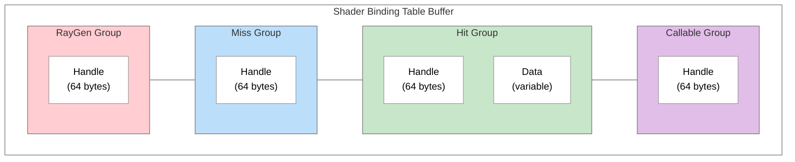
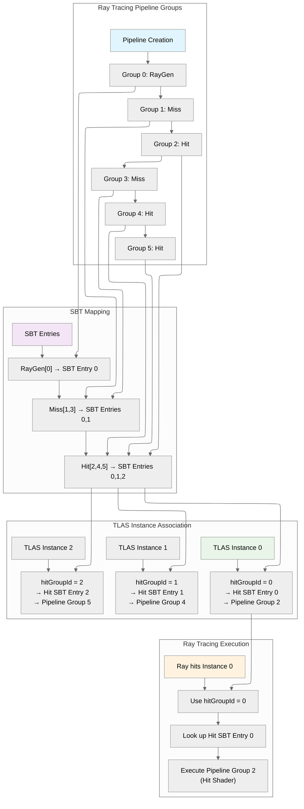
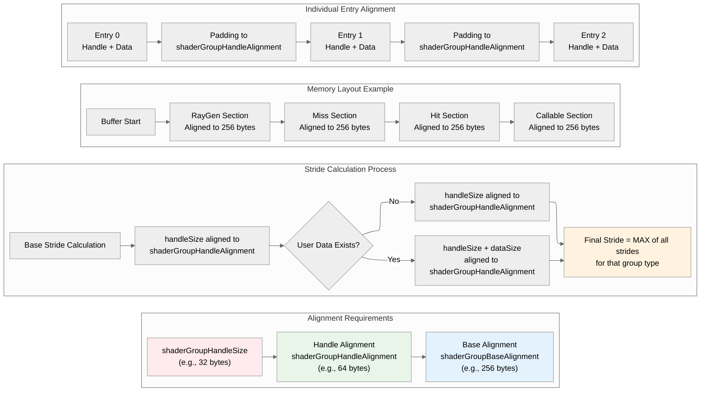

# Shader Binding Table (SBT) in Vulkan Ray Tracing

## Table of Contents

1. [Overview](#overview)
2. [Quick Start Guide](#quick-start-guide)
3. [Purpose and Function](#purpose-and-function)
4. [SBT Structure](#sbt-structure)
5. [Understanding Shader Group Indices](#understanding-shader-group-indices)
6. [Key Properties and Alignment](#key-properties-and-alignment)
7. [SBT Generation Process](#sbt-generation-process)
8. [Advanced SBT Features](#advanced-sbt-features)
9. [Usage in Ray Tracing](#usage-in-ray-tracing)
10. [Best Practices](#best-practices)
11. [Common Pitfalls](#common-pitfalls)


## Overview

The Shader Binding Table (SBT) is a fundamental component in Vulkan ray tracing that serves as the "blueprint" for the ray tracing process. Unlike traditional rasterization where shaders are bound sequentially for different objects, ray tracing requires all shaders to be available simultaneously since rays can hit any surface in the scene at any time.

The `nvvk::SBTGenerator` class is a helper utility that simplifies the complex process of creating and managing the SBT. It handles the intricate details of buffer creation, alignment calculations, and shader handle retrieval, making it easier to create the information that will be stored in the SBT buffer and retrieve the handles used by the ray tracer when calling `vkCmdTraceRaysKHR`.

## Quick Start Guide

Here's the minimal code to get an SBT working in just 5 steps:

```cpp
// 1. Initialize the SBT generator
nvvk::SBTGenerator sbtGen;
sbtGen.init(device, rayProperties);

// 2. Calculate required buffer size
size_t bufferSize = sbtGen.calculateSBTBufferSize(rtPipeline, pipelineInfo);

// 3. Create the SBT buffer
nvvk::Buffer sbtBuffer;
allocator.createBuffer(sbtBuffer, bufferSize, 
    VK_BUFFER_USAGE_2_SHADER_BINDING_TABLE_BIT_KHR | VK_BUFFER_USAGE_2_SHADER_DEVICE_ADDRESS_BIT,
    VMA_MEMORY_USAGE_AUTO_PREFER_DEVICE,
    VMA_ALLOCATION_CREATE_MAPPED_BIT,
    sbtGen.getBufferAlignment());

// 4. Populate the SBT buffer with shader handles
sbtGen.populateSBTBuffer(sbtBuffer.address, bufferSize, sbtBuffer.mapping);

// 5. Use the SBT in ray tracing
vkCmdTraceRaysKHR(cmd, 
    &sbtGen.getSBTRegions().raygen,    // Ray generation shader
    &sbtGen.getSBTRegions().miss,      // Miss shader  
    &sbtGen.getSBTRegions().hit,       // Hit shader
    &sbtGen.getSBTRegions().callable,  // Callable shader (optional)
    width, height, 1);                 // Dimensions
```

**What this does:**
- **Step 1**: Sets up the SBT generator with your device and ray tracing properties
- **Step 2**: Calculates exact memory requirements (handles alignment automatically)
- **Step 3**: Creates a properly aligned buffer for the SBT
- **Step 4**: Fills the buffer with shader handles from your pipeline
- **Step 5**: Uses the SBT to trace rays with your shaders

**Prerequisites:**
- A ray tracing pipeline create info (`pipelineInfo`) which was used to create the pipeline
- A ray tracing pipeline (`rtPipeline`) with shader groups
- A resource allocator (`allocator`) for buffer creation
- Ray tracing properties (`rayProperties`) from your physical device

This minimal setup handles all the complex alignment requirements and gives you a working SBT. See the sections below for advanced features like custom data, multiple shader groups, and performance optimization.

## Purpose and Function

The SBT allows us to:
- Select which ray generation shader to use as the entry point
- Specify which miss shader to execute when no intersections are found
- Define which hit shader groups can be executed for each instance
- Associate instances with specific shader groups through the `hitGroupId` in the TLAS

## SBT Structure

The SBT consists of up to four arrays, each containing handles to shader groups:

1. **Ray Generation (RayGen)** - Entry point for ray tracing
2. **Miss** - Executed when rays don't hit anything
3. **Hit** - Executed when rays intersect with geometry
4. **Callable** - Optional shaders that can be invoked from other shaders


### Buffer Layout





**Note:** While all group types can technically have user data attached, **Hit groups are the primary use case** for data attachment (e.g., material properties, per-instance data). RayGen, Miss, and Callable groups typically only contain shader handles.

Example of a raygen, miss and hit shader. (02_basic)


Example where there are two miss shaders. (05_shadow_miss)


## Understanding Shader Group Indices

**What are "indices"?**

In the context of SBT, "indices" refer to the **position (index) of shader groups within the ray tracing pipeline**. When you create a pipeline with multiple shader groups, each group gets a sequential index starting from 0.

**Example Pipeline Layout:**
```
Pipeline Groups: [RayGen:0, Miss:1, Hit:2, Miss:3, Hit:4, Hit:5]
Group Types:     RayGen[0], Miss[1,3], Hit[2,4,5]
```

**Why This Matters:**
- **SBT Mapping**: The SBT maps pipeline group indices to actual shader handles
- **Instance Association**: TLAS instances use `hitGroupId` to reference specific SBT entries
- **Shader Selection**: The ray tracer uses these indices to determine which shader to execute

**How Indices Are Used:**
1. **Automatic Discovery**: `addIndices()` automatically finds all group indices from pipeline creation info
2. **Manual Control**: `addIndex()` allows manual specification for custom layouts
3. **Data Association**: User data is attached to specific indices via `addData()`

**Special Cases:**
- **Library Support**: When using pipeline libraries, indices are offset to ensure uniqueness
- **Duplicate Entries**: Multiple SBT entries can reference the same pipeline group (useful for different data)





## Key Properties and Alignment

The SBT relies on several Vulkan ray tracing properties:

- **`shaderGroupHandleSize`** - Size of a program identifier (handle)
- **`shaderGroupHandleAlignment`** - Alignment in bytes for each SBT entry
- **`shaderGroupBaseAlignment`** - Alignment for starting addresses of each group

### Alignment Rules

1. **RayGen Group**: Must be aligned to `shaderGroupBaseAlignment`
2. **All Groups**: Starting addresses must be aligned to `shaderGroupBaseAlignment`
3. **Individual Entries**: Must be aligned to `shaderGroupHandleAlignment`
4. **RayGen Stride**: Must equal the size (special case)





### Size Calculation Formula

```cpp
// For each group type
stride = align_up(handleSize + dataSize, shaderGroupHandleAlignment);
size = align_up(count * stride, shaderGroupBaseAlignment);

// Total buffer size
totalSize = align_up(raygenSize, bufferAlignment) +
            align_up(missSize, bufferAlignment) +
            align_up(hitSize, bufferAlignment) +
            align_up(callableSize, bufferAlignment);
```

**Why Stride Matters:**

1. **Uniform Entry Size**: All entries within a group must have the same size for the ray tracer to calculate offsets correctly
2. **Data Alignment**: Each entry is aligned to `shaderGroupHandleAlignment` to ensure proper memory access
3. **RayGen Special Case**: RayGen stride must be aligned to `shaderGroupBaseAlignment` because it's the entry point

**Stride Calculation Process:**
1. **Base Stride**: Start with `handleSize` aligned to `handleAlignment`
2. **Data Stride**: If user data exists, calculate `handleSize + dataSize` aligned to `handleAlignment`
3. **Final Stride**: Use the maximum of all strides for that group type
4. **Group Alignment**: Each group section is aligned to `shaderGroupBaseAlignment`

## SBT Generation Process

The `nvvk::SBTGenerator` class is a helper utility that simplifies the complex process of creating and managing the Shader Binding Table. It handles the intricate details of buffer creation, alignment calculations, and shader handle retrieval, making it easier to create the information that will be stored in the SBT buffer.

### 1. Initialization

```cpp
SBTGenerator sbtGenerator;
sbtGenerator.init(device, rayProperties);
```

### 2. Buffer Size Calculation

```cpp
size_t bufferSize = sbtGenerator.calculateSBTBufferSize(
    rtPipeline, rayPipelineInfo, librariesInfo);
```

This calculates:
- Required buffer size
- Stride for each group type
- Buffer offsets for each group
- Total memory requirements

**What happens internally:**

1. **Group Index Discovery**: The function analyzes the pipeline to find the position (index) of each shader group type:
   - **RayGen groups**: Groups containing raygen shaders
   - **Miss groups**: Groups containing miss shaders  
   - **Hit groups**: Groups containing closest-hit, any-hit, or intersection shaders
   - **Callable groups**: Groups containing callable shaders

2. **Stride Calculation**: For each group type, it calculates the required stride:
   - **Base stride**: `handleSize` aligned to `shaderGroupHandleAlignment`
   - **Data stride**: If user data is attached, the stride becomes `handleSize + dataSize` aligned to `shaderGroupHandleAlignment`
   - **Final stride**: The maximum of all strides for that group type
   - **Special case**: RayGen stride must be aligned to `shaderGroupBaseAlignment`

3. **Buffer Layout**: Each group section is aligned to `shaderGroupBaseAlignment`, ensuring proper memory layout for the ray tracer.

### 3. Buffer Creation

```cpp
// Create SBT buffer with proper usage flags
VkBufferUsageFlags usage = VK_BUFFER_USAGE_2_SHADER_BINDING_TABLE_BIT_KHR |
                           VK_BUFFER_USAGE_2_SHADER_DEVICE_ADDRESS_BIT;

allocator.createBuffer(sbtBuffer, bufferSize, usage, 
                      VMA_MEMORY_USAGE_AUTO_PREFER_DEVICE,
                      VMA_ALLOCATION_CREATE_MAPPED_BIT,
                      sbtGenerator.getBufferAlignment());
```

**Important:** The user is responsible for creating the buffer using the size and alignment information provided by `calculateSBTBufferSize()`. The SBT generator only calculates the requirements and populates the buffer - it does not create the buffer itself.

### 4. SBT Population

```cpp
sbtGenerator.populateSBTBuffer(sbtBuffer.address, bufferSize, sbtBuffer.mapping);
```

This process:

- Retrieves shader handles from the pipeline
- Copies handles to the SBT buffer
- Applies any user-provided data
- Calculates final device addresses

**Technical Details:**

1. **Handle Retrieval**: Uses `vkGetRayTracingShaderGroupHandlesKHR` to get all shader handles from the pipeline
2. **Buffer Population**: For each group type, writes handles and optional user data to the buffer:
   - **Handle**: The shader program identifier (always present)
   - **User Data**: Any additional data attached via `addData()` (optional)
   - **Stride**: Each entry is padded to match the calculated stride for that group type
3. **Address Calculation**: Converts buffer offsets to full device addresses for use in `vkCmdTraceRaysKHR`

The buffer contains all the necessary data, and the handle provided to the ray tracer specifies where in the buffer the ray tracer should access this data.

## Advanced SBT Features

### Custom Data Attachment

The SBT can store custom data alongside shader handles:

```cpp
struct HitRecordBuffer {
    std::array<float, 4> color;
};

// Add data to specific hit groups
sbtGenerator.addData(SBTGenerator::eHit, 0, hitData0);
sbtGenerator.addData(SBTGenerator::eHit, 1, hitData1);
```

See the tutorial 07_multi_closest_hit for an example.

### Multiple Shader Groups

You can have more SBT entries than pipeline groups by duplicating entries:

```cpp
// Pipeline has 2 hit groups, but SBT has 3
sbtGenerator.addIndices(rayPipelineInfo);  // Add groups 0, 1
sbtGenerator.addIndex(SBTGenerator::eHit, 2);  // Duplicate group 1
sbtGenerator.addData(SBTGenerator::eHit, 2, customData);  // Custom data for entry 2
```

See the tutorial 07_multi_closest_hit for an example.

### Manual Group Index Specification

Instead of using `addIndices()`, you can manually specify group indices for complete control:

```cpp
// Manually define group indices
sbtGenerator.addIndex(SBTGenerator::eRaygen, 0);   // RayGen group 0
sbtGenerator.addIndex(SBTGenerator::eMiss, 1);     // Miss group 1
sbtGenerator.addIndex(SBTGenerator::eMiss, 2);     // Miss group 2
sbtGenerator.addIndex(SBTGenerator::eHit, 3);      // Hit group 3
sbtGenerator.addIndex(SBTGenerator::eHit, 4);      // Hit group 4

// Add custom data to specific groups
sbtGenerator.addData(SBTGenerator::eHit, 3, hitData0);
sbtGenerator.addData(SBTGenerator::eHit, 4, hitData1);
```

### Library Support

The SBT generator supports pipeline libraries:

```cpp
std::vector<VkRayTracingPipelineCreateInfoKHR> libraries = {lib1, lib2};
sbtGenerator.addIndices(rayPipelineInfo, libraries);
```

## Usage in Ray Tracing

### Retrieving SBT Regions

```cpp
const SBTGenerator::Regions sbtRegions = sbtGenerator.getSBTRegions();

// Access individual regions
VkStridedDeviceAddressRegionKHR raygenRegion = sbtRegions.raygen;
VkStridedDeviceAddressRegionKHR missRegion = sbtRegions.miss;
VkStridedDeviceAddressRegionKHR hitRegion = sbtRegions.hit;
VkStridedDeviceAddressRegionKHR callableRegion = sbtRegions.callable;
```

### Tracing Rays

```cpp
vkCmdTraceRaysKHR(cmdBuffer,
                   &sbtRegions.raygen,    // Ray generation shader
                   &sbtRegions.miss,      // Miss shader
                   &sbtRegions.hit,       // Hit shader
                   &sbtRegions.callable,  // Callable shader
                   width, height, 1);     // Dimensions
```


## Best Practices

1. **Alignment**: Always respect alignment requirements to avoid validation errors
2. **Memory Layout**: Use the calculated offsets and strides from the generator
3. **Performance**: Consider using device-local memory for production applications
4. **Debugging**: Use debug names for SBT buffers in development tools
5. **Validation**: Ensure buffer size matches calculated requirements exactly

## Common Pitfalls

1. **Ignoring Alignment**: Not aligning to required boundaries causes validation failures
2. **Buffer Size Mismatch**: Using incorrect buffer size leads to undefined behavior
3. **Missing Usage Flags**: Forgetting `VK_BUFFER_USAGE_2_SHADER_BINDING_TABLE_BIT_KHR`
4. **Stride Confusion**: RayGen stride must equal size, other groups can have different strides
5. **Handle Index Mismatch**: Incorrect mapping between pipeline groups and SBT entries

